# 框架

>进程和线程
>
>共享模型
>
>非共享模型
>
>并行
>
>其他


[TOC]


# 1 进程和线程

## 1.1 进程和线程的对比

进程

- 计算机执行时的一个实例(程序从磁盘中加载至内存,就开启了一个线程),它包括程序代码和当前的活动(程序运行).
- 进程可以是由多个线程并行执行而组成.
- windows中的进程是不活动的,只是作为线程的容器

线程

- 进程可以是由一个或多个线程组成

- 是一个指令流,将指令流中的指令以一定的顺序交给cpu执行.
- 在java中,线程作为最小的调度单位;进程作为资源分配的最小单位.

对比

- 进程相互独立,线程存在于进程中
- 进程有用于内部共享的资源,如内存空间,供其内部的线程共享
- 进程间通信复杂
  - 同一台计算机内部的进程通信称为 IPC(inter-process communication)
  - 不同计算机间的进程通信,需要通过网络,并遵循协议,如HTTP
- 线程通信相对简单,因为他们共享进程内的内存
- 线程轻量,线程的上下文切换成本比进程上下文切换低

---

## 1.2 并行和并发

### 1.2.1 单核和多核cpu

单核cpu下,**微观串行,宏观并行**:

单核cpu下的线程实际上是串行执行的,操作系统的任务调度组件,把cpu的的执行时间分片(windows下时间片最小约15毫秒),每一个时间片分给不同的程序使用,并切换的速度很快,给人一种同时执行的错觉.


多核cpu下,每个核都可以调度运行程序,此时线程才可以并行执行:

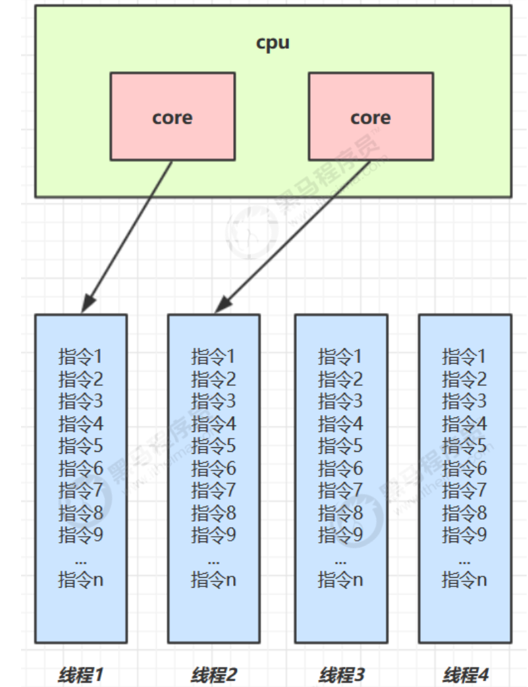

### 1.2.2 并发和并行

rob pike:

- 并发(concurrent)是同一时间应对多件事情的能力
- 并行(parallel)是同一时间动手做多件事情的能力


---

## 1.3 应用

### 1.3.1 多线程异步调用(并发能力)

从调用方的角度:

- 需要等待结果返回,才能继续运行的就是同步
- 不需要等待结果返回,就能继续运行的就是异步

多线程可以让方法的执行变为异步:

​	比如读取磁盘文件,读取消耗的时长如果是同步,那么这段时间内cpu只能等待结果返回

应用:

- 操作费时的任务,可以单独开启一个新线程处理,避免阻塞主线程
- tomcat的异步servlet,让用户线程处理耗时长的操作,避免阻塞tomcat的工作线程


### 1.3.2 多线程提升效率(并行能力)

需要执行的多个计算,最后汇总结果,

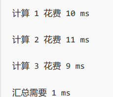

- 如果是串行计算,总花费为31ms
- 如果是多核cpu,例如4核,各个核心分别使用不同的线程计算,那么三个线程的计算是并行的,计算时长只取决与最长的那个线程运行时间(11ms),最后再汇总结果,最终只需12ms

> 注意: 并行是需要多核cpu才能提高效率,单核cpu仍然是串行计算

应用:

- 单核cpu下,多线程不能实际提升程序运行效率
- 多核cpu可以并行跑多个线程,但是否提高程序运行效率还是分情况的
  - 有些任务可以拆分,并行执行,可以提升效率
  - 但不是所有的计算任务都可拆分,(如 阿姆达尔定律)
  - 也不是所有的任务都需要拆分,如果任务的目的不同就没有意义了
- io操作不占用cpu,只是我们使用的是**阻塞io**,相当于线程虽然不用cpu,但是需要一直等待io结束(后面的非阻塞io和异步io处理这类问题)

---

# 2 java线程

## 2.1 创建和运行线程

**方式1**: new thread

```java
public static void m1() {
  Thread t1 = new Thread("t1") {
    @Override
    public void run() {
      log.debug("t1 running");
    }
  };
  t1.start();
}
```

**方式2**: 使用runnable配合thread

把任务和线程分离,runnable表示任务,thread表示线程

```java
public static void m2() {
  Runnable r2 = new Runnable() {
    @Override
    public void run() {
      log.debug("t2 running");
    }
  };
  Thread t2 = new Thread(r2, "t2");
  t2.start();
}
```

lambda写法

```java
public static void m2jdk8() {
  Runnable task = () -> log.debug("t2 running");
  Thread t2 = new Thread(task, "t2");
  t2.start();
}
```

小结:

- 使用Runnable更容易与线程池等高级API配合使用
- 用Runnable让任务类脱离Thread的继承体系,更灵活


**方式3**: 使用FutureTask配合Runnable

FutureTask能够接受Callable类型的参数,用来处理带有返回结果的情况

```java
public static void m3() {
  FutureTask<Integer> task = new FutureTask<>(() -> {
    log.debug("t3 running");
    return 100;
  });

  Thread t3 = new Thread(task, "t3");
  t3.start();

  // 主线程注册,等待task执行完毕后返回结果
  Integer result = null;
  try {
    result = task.get();
  } catch (Exception e) {
    throw new RuntimeException(e);
  }
  log.debug("t3 running result" + String.valueOf(result));

}
```

---

## 2.3 线程运行原理

### 2.3.1 栈和栈帧

jvm的虚拟机栈,在每个**线程**启动后,虚拟机都会为其分配一块栈内存

- 每个栈由多个栈帧(Frame)组成,对应着每次方法调用时所占用的内存
- 每个线程只能有一个活动栈帧,对应着当前正在执行的方法

```java
public class FrameTest {
  public static void main(String[] args) {
    method1(10);
  }
  private static void method1(int x) {
    int y = x + 1;
    Object m = method2();
    System.out.println(m);
  }
  private static Object method2() {
    return new Object();
  }
}
```


```java
public class FrameTest {
  public static void main(String[] args) {
    Thread thread = new Thread("t1") {
      @Override
      public void run() {
        method1(20);
      }
    };
    thread.start();

    method1(10);
  }
  private static void method1(int x) {
    int y = x + 1;
    Object m = method2();
    System.out.println(m);
  }

  private static Object method2() {
    return new Object();
  }


}
```


mian线程栈帧运行图示:

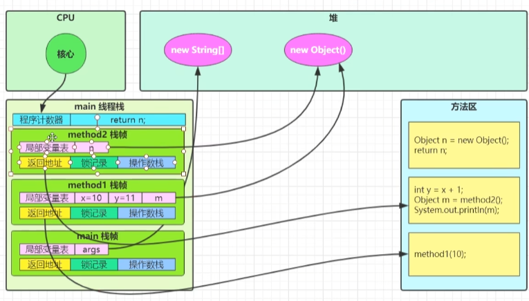

### 2.3.2 上下文切换(Thread Context Switch)

由于一些原因,导致cpu不再执行当前线程,转而执行另一个线程的代码

- 线程的cpu时间片用完
- 垃圾回收
- 有更高优先级的线程需要运行
- 线程自己调用了`sleep,yield,wait,join,park,synchronized,lock`等方法

当上下文切换时,需要由操作系统保存当前线程的状态,并恢复另一个线程的状态(线程中的状态有以下几种)

- 程序计数器
- 栈帧信息(如局部变量,操作数栈,返回地址等)

> 注: 程序计数器
>
> 作用是记录下一条jvm指令的执行地址,是线程私有的

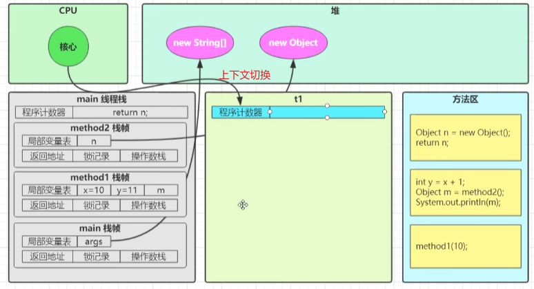

## 2.4 线程API

|       方法名        | static |                功能说明                 |                            注意点                            |
| :-----------------: | :----: | :-------------------------------------: | :----------------------------------------------------------: |
|       start()       |        |          启动线程,调用run方法           | start方法只是让线程进入就绪,代码不一定立即执行(等待时间片),每个线程对象的start方法只执行一次,调用多次出现IllegalThreadStateException |
|        run()        |        |           线程实际执行的方法            | 构造Thread时传入Runnable参数,线程启动后会调用Runnable的run方法;也可以创建Thread的之类对象来重写该方法 |
|       join()        |        |            等待线程运行结束             |                                                              |
|    join(long n)     |        |      等待线程运行结束,最多等待n秒       |                                                              |
|       getId()       |        |           获取线程长整型的id            |                            id唯一                            |
| getName()/setName() |        |             获取/修改线程名             |                                                              |
|    getPriority()    |        |             修改线程优先级              | java中规定线程优先级是1-10的整数,较大优先级能提高该线程被cpu调度的几率(不能确保先执行) |
|     getState()      |        |              获取线程状态               | java中的线程状态是由6个enum表示,分别是:NEW,RUNNBALE,BLOCKED,WAITING,TIMED_WAITING,TERMINATED |
|   isInterrupted()   |        |             判断是否被打断              |                        不清除打断标记                        |
|      isAlive()      |        |              线程是否存活               |                                                              |
|     interrupt()     |        |                打断线程                 | 如果被打断的线程正在sleep,wait,join,会导致被打断的线程抛出InterruptedException,并清除打断标记;如果打断的是正在运行的线程,会设置打断标记;park的线程被打断,也会设置打断标记(Thread.*interrupted*()会清除打断标志) |
|    interrupted()    | static |             判断是否被打断              |                        会清除打断标记                        |
|   currentThread()   | static |         获取当前正在执行的线程          |                                                              |
|    sleep(long n)    | static |  让当前执行的线程休眠n毫秒,让出时间片   |                                                              |
|       yield()       | static | 提示线程调度器让出了当前线程对cpu的使用 |                           测试使用                           |


### 2.4.1 start与run

- 直接调用run,是在主线程中执行run方法,并没有启动新线程,方法执行仍然是同步的
- 使用start是启动新线程,通过新线程间接执行run中的代码,异步的

### 2.4.2 sleep与yield

sleep方法:

- 调用sleep会让当前线程从RUNNING进入Timed_Waiting状态(阻塞)

- 其他线程使用睡眠线程的interrupt方法打断正在睡眠的线程,这时的sleep方法会抛出InterruptedException
- 睡眠结束后线程未必立刻得到执行
- 剪影使用TimeUnit的sleep代替Thread的Sleep来获得更高的可读性

yield方法:

- 调用yield会让当前线程从Running进入Runnable就绪状态,然后调度执行其它线程
- 具体的实现依赖于操作系统的任务调度器

vs:

sleep和yield都会让出线程,但是yield仍然有机会获得时间片,而sleep会阻塞,无法参与到时间片的分配

> sleep的小应用,防止cpu占用100%:
>
> 

### 2.4.3 线程优先级

- 线程优先级会**提示**调度器优先调度该线程,但它仅仅只是一个提示,调度器可以忽略
- 如果cpu比较忙,优先级高可能会获得更多的时间片;但是cpu闲时,优先级几乎没有作用

### 2.4.4 join方法

```java
public static void test1() throws InterruptedException {
  Thread t1 = new Thread(() -> {
    try {
      TimeUnit.SECONDS.sleep(1);
      r1 = 10;
    } catch (InterruptedException e) {
      throw new RuntimeException(e);
    }
  }, "t1");

  Thread t2 = new Thread(() -> {
    try {
      TimeUnit.SECONDS.sleep(2);
      r2 = 20;
    } catch (InterruptedException e) {
      throw new RuntimeException(e);
    }
  }, "t2");

  long start = System.currentTimeMillis();
  t1.start();
  t2.start();

  t1.join();
  t2.join();
  long end = System.currentTimeMillis();

  log.debug("r1: {}, r2: {}, cost: {}", r1, r2, end - start);

}
```


`join`方法可以让其它线程等待该线程结束,形成同步关系

**带时效的join**,如下图:


- 线程执行**2s,**只是等待**1.5s,**线程提前结束,程序执行1.5s
- 线程执行**1s,**只是等待**1.5s,**线程提前结束,程序执行1s

### 2.4.5 interrupt

- 打断阻塞状态的线程,会清除打断状态(调用isInterrupted()为false)

> 注
>
> - sleep,wait,join(底层还是wati)会使线程进入阻塞状态
> - 打断状态,实际上是给线程设置一个**中断标志**,线程仍然会继续运行

```java
// 阻塞线程(sleep, wait, join)打断抛出异常
private static void test1() throws InterruptedException {
  Thread t1 = new Thread("t1") {
    @Override
    public void run() {
      log.debug("enter sleep...");
      try {
        Thread.sleep(2000);
      } catch (InterruptedException e) {
        log.debug("线程打断状态: {}", isInterrupted());
        log.error("wake up...");
        e.printStackTrace();
      }
    }
  };

  t1.start();

  Thread.sleep(1000);

  log.debug("interrupt...");
  t1.interrupt();
  log.debug("线程打断状态: {}", t1.isInterrupted());
}
```


- 打断正常运行的线程,不会清除打断状态,中断标志位true

```java
// 正常线程打断,中断标志为true
private static void test2() throws InterruptedException {
  Thread t1 = new Thread(() -> {
    while (true) {
      Thread current = Thread.currentThread();
      boolean interrupted = current.isInterrupted();
      if (interrupted) {
        log.debug("中断标志: {}", interrupted);
        break;
      }
    }
  }, "t1");

  t1.start();

  TimeUnit.SECONDS.sleep(1);
  t1.interrupt();

}
```
---

#### 模式:interrupt-终止模式之两阶段终止模式

> 在一个线程t1中如何优雅的终止另一个线程t2?t2在进入终止前还能执行一些其它任务后终止

错误实践:

- 使用stop()停止线程

stop()方法会杀死线程,这时如果线程锁住了共享资源,就会造成死锁

- 使用System.exit(int)停止线程

这种会停止整个程序

**两阶段终止模式**

> 场景:
>
> 监控线程,每隔2s记录一次.希望存在一个入口,可以让监控程序暂停


- 使用interrupted

  ```java
  @Slf4j(topic = "c.Monitor")
  class MonitorInterrupted {
  
    private Thread thread;
  
    public void start() {
      thread = new Thread(() -> {
        while (true) {
          Thread current = Thread.currentThread();
          if (current.isInterrupted()) {
            log.debug("料理后事");
            break;
          }
  
          try {
            TimeUnit.SECONDS.sleep(1);
            log.debug("等待1s后保存结果");
          } catch (InterruptedException e) {
            e.printStackTrace();
            // 睡眠时被打断,中断标记为false
            // 重新设置打断标记为true
            current.interrupt();
          }
        }
      }, "监控程序");
  
      thread.start();
    }
  
    public void stop() {
      // 正常运行执行打断,中断标志为true
      thread.interrupt();
    }
  }
  ```

---

- 打断park线程,不会清除中断,但是再次park会失效

使用Thread.interrupted()会清除中断标志,park仍然有效

```java
// 打断park线程,不清除中断
private static void test3() throws InterruptedException {
  Thread t1 = new Thread(() -> {
    log.debug("park...");
    LockSupport.park();
    log.debug("unPark...");
    // log.debug("打断状态: {}...", Thread.currentThread().isInterrupted());
    log.debug("打断状态: {}...", Thread.interrupted());

    // 再次打断
    // isInterrupted()不会清除中断标志,再次使用park会失效
    // Thread.interrupted()会清除中断标志,park仍然有效
    LockSupport.park();
    log.debug("unPark...");

  }, "t1");

  t1.start();

  TimeUnit.MILLISECONDS.sleep(500);
  t1.interrupt();

}
```

### 2.4.6 不推荐使用的api


## 2.5 主线程和守护线程

默认情况下,java进程需要等待所有进程结束,才会退出

有一种特殊的线程称为守护线程,只要当其它的会守护线程运行结束了,即使守护线程的代码没有执行完,都会强制结束

```java
private static void test1() throws InterruptedException {
  Thread t1 = new Thread(() -> {
    while (true) {
      // 线程设置了daemon
      // 其它非守护线程结束,触发interrupt
      if (Thread.currentThread().isInterrupted()) {
        log.debug("结束");
        break;
      }
    }
  }, "t1");

  // 启动前设置守护线程
  t1.setDaemon(true);
  t1.start();

  Thread.sleep(1000);
  log.debug("结束");
}
```

> 注:
>
> 1.垃圾回收器线程就是一种守护线程
>
> 2.tomcat中的Accptor和Poller线程都是守护线程,所有当Tomcat接受到shutdown命令后,不会等他们处理完当前的请求

## 2.6 线程状态

### 2.6.1 五状态模型

> 操作系统层面描述

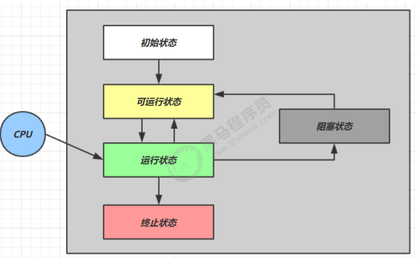

- 初始状态

仅在代码层面创建了线程对象,没有和操作系统线程关联

- 可运行/就绪状态

线程已经被创建,且和操作系统关联.具备可以被cpu调度执行

- 运行状态

获得了cpu的时间片,处于运行中

当cpu时间片用完,会从运行状态切换到可运行状态(会执行上下文切换)

- 阻塞状态

调用阻塞api,如bio读写文件等,这时线程不用cpu(会执行上下文切换),进入阻塞

等bio操作完毕,会由操作系统唤醒阻塞状态的线程,转至可运行状态

阻塞和可运行状态的区别在于,处于阻塞态的线程,调度器不考虑分配时间片

- 终止状态

表示线程已经执行完毕,生命周期已经结束,状态不会再切换了

### 2.6.2 六状态模型

> 从java api层面描述,根据Thread.State枚举,分为六种状态


- NEW

线程刚被创建,但是没有调用start()方法

- RUNNABLE

调用start()后

> 注:
>
> java api层面的RUNNABLE状态涵盖了操作系统层面的
>
> 可运行状态,运行状态,阻塞状态
>
> (对应bio导致线程的阻塞,在java中无法区分,仍然被认定为是可运行状态)

- BLOCKED,WAITING,TIMED_WAITING

java api层面对阻塞状态的细分

- TERMINATED

当前线程代码运行结束

```java
// NEW 没有调用start方法
Thread t1 = new Thread(() -> {
  log.debug("running");
}, "t1");

// RUNNABLE 运行状态,包括了os的可运行,运行和阻塞状态
Thread t2 = new Thread(() -> {
  while (true) {

  }
}, "t2");
t2.start();

// TERMINATED 运行结束
Thread t3 = new Thread(() -> {

}, "t3");
t3.start();

// TIMED_WAITING 阻塞状态的一种,有时间的阻塞
Thread t4 = new Thread(() -> {
  synchronized (TreadStateTest.class) {
    try {
      TimeUnit.SECONDS.sleep(1000);
    } catch (InterruptedException e) {
      e.printStackTrace();
    }
  }
}, "t4");
t4.start();

// WAITING 阻塞,等待线程2结束(线程2当前在运行)
Thread t5 = new Thread(() -> {
  try {
    t2.join();
  } catch (InterruptedException e) {
    e.printStackTrace();
  }

}, "t5");
t5.start();

// BLOCKED 阻塞,等待获取锁
Thread t6 = new Thread(() -> {
  synchronized (TreadStateTest.class) {
    try {
      Thread.sleep(1000000);
    } catch (InterruptedException e) {
      e.printStackTrace();
    }
  }

}, "t6");
t6.start();
```

---


# 3 共享模型之管程


## 3.1 共享问题

```java
public static void main(String[] args) throws InterruptedException {
  Thread t1 = new Thread(() -> {
    for (int i = 0; i < 15000; i++) {
      count++;
    }
  }, "t1");


  Thread t2 = new Thread(() -> {
    for (int i = 0; i < 15000; i++) {
      count--;
    }
  }, "t2");

  t1.start();
  t2.start();

  t1.join();
  t2.join();

  log.debug("count: {}", count);


}
```

多线程对于**共享资源**的访问,会导致最终的结果可能是正数,负数或者0

分析:

java内存模型中,静态资源(共享)的自增,自减需要在主存和工作内存中进行数据交换


单线程情况下,不会出现问题,共享资源只有一个线程使用

多线程情况下:

出现负数的情况


出现正数的情况


### 3.1.1 临界区

critical section

- 程序运行多线程本身没有问题
- 出现问题在于多哥线程访问共享资源
  - 多线程**读**共享资源也没有问题
  - 多线程**读写**共享资源时指令出现交错,会出现问题
- 一段代码内,存在对共享资源的多线程读写操作,称这段代码块为**临界区**

### 3.1.2 竞态条件

多个线程在临界区执行,由于代码的**执行序列不同**而导致结果无法预测,称之为发生了竞态条件,即出现并发问题

为避免临界区的竞态条件的产生,可以使用以下方案解决:

- 阻塞式的解决方案:synchronized,lock
- 非阻塞式的: 原子变量

## 3.2 synchronized

synchronized,又称为**对象锁**.它采用互斥的方式让同一时刻只能有一个线程持有对象锁,其它线程BLOCKED,拥有锁的线程才能执行临界区的代码

> 注:
>
> java中互斥和同步都可以使用synchronized关键字完成,但是区别在于:
>
> - 互斥是保证临界区代码不出现竞态条件,同一时刻只有一个线程执行临界区代码
> - 同步是由于线程执行的先后顺序不同,一个线程需要等待另一个线程运行到某个点


理解synchronized:

- `synchronized(对象)`中的对象,可以理解成房间,进入房间需要锁住门,防止其它人进入
- 当t1执行到synchronized时,表示t1进入房间,并且锁住了门,在门内执行count++
- 当t2执行到synchronized时,发现门被锁住,只能等待(线程上下文切换,状态转为BOLCKED)
- 这是即使t1的时间片用完,被踢出了门外(不要错误理解为锁住的对象就能一直执行,需要时间片),这是门仍然是锁住的,t2还在阻塞,只有下次时间片分配给t1时,t1才能继续执行
- 当t1执行完synchronized中的代码,这时会解锁,唤醒t2线程,t2就可以获得锁,锁住门执行count--

图示:


思考:

> synchronized实际是用**对象锁保证了临界区内代码的原子性**,使得临界区内的代码对外是不可分隔的,不会被线程切换打断

考虑以下几个问题:

- synchronized放在for循环外?

等到for循环(原子)执行结束后才释放锁

- 若t1锁obj1,而t2锁obj2,代码怎样运行?

不同的锁对象不能保证唯一进入

- 如果t1枷锁,而t2没有加?

t2不会被阻塞,不用获取锁对象,仍然不能唯一进入

### 3.2.1 synchronized的其它使用

- 加在成员方法上

相当于锁住this对象

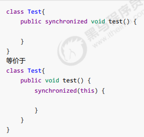

- 加载静态方法上

相对于锁住类对象

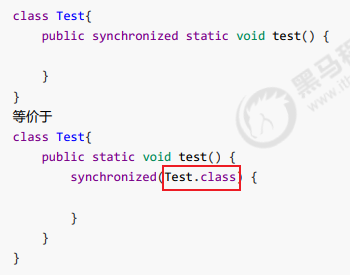

### 3.2.2 线程八锁

> 考察synchronized锁住的是哪个对象

- 情况一: 

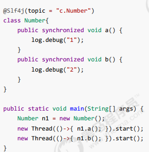

12或者21

- 情况二:


1s后12,2 1s后1

- 情况三:


3不需要等锁:

32 1s后1(t2先锁)

3 1s后12(t1先锁)

23 1s后1

- 情况四:


不同锁对象:

2 1s后1

- 情况五:


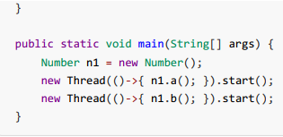

不同锁对象,t1锁类对象,t2锁实例n1:

2 1s后1

- 情况6:


1s后12, 2 1s后1

- 情况七:


不同锁对象:

2 1s后1

- 情况八:


1s后 12, 2 1s后1

---

## 3.3 变量线程安全分析

1. **成员变量和静态变量**是否线程安全

- 如果没有被共享,则线程安全

- 如果被共享了,则根据是否会被改变状态,分为以下两种情况:
  - 如果只有读操作,则线程安全
  - 如果有读写操作,则需要考虑线程安全

2. 局部变量的线程安全性

- 局部变量线程安全

- 但局部变量的**引用对象**未必安全

  - 如果该对象只在方法内作用,则是线程安全的
  - 如果对象方法外也有(return出去了),则需要考虑线程安全

  

### 3.3.1 局部变量线程安全分析

- 局部变量(非引用类型)

每个线程在调用方法时,线程内的栈帧会存放一份局部变量(非引用类型),不存在共享


- 局部变量是引用类型

```java
public class VarUnSafeTest {

  // 启动线程数
  static final int THREAD_NUMBER = 2;

  // 循环次数
  static final int LOOP_NUMBER = 200;

  public static void main(String[] args) {
    ThreadUnsafe test = new ThreadUnsafe();
    for (int i = 0; i < THREAD_NUMBER; i++) {
      new Thread(() -> {
        test.method1(LOOP_NUMBER);
      }, "thread" + i).start();
    }

  }
}

/**
 * 出现的异常分析(ArrayIndexOutOfBoundsException):
 *  线程2还没add
 *  线程1就执行了remove
 */
class ThreadUnsafe {

  // 成员变量,在堆中
  ArrayList<String> list = new ArrayList<>();

  public void method1(int loopNumber) {
    for (int i = 0; i < loopNumber; i++) {
      // 临界区
      method2();
      method3();
    }

  }

  public void method2() {
    list.add("1");
  }

  public void method3() {
    list.remove(0);
  }

}
```

分析:

多个线程对共享资源进行读写


- 将list成员变量修改为局部变量,不存在共享,就没有线程安全问题

```java
/**
 *  两个线程调用method1,会在堆中创建两个局部变量,不存在共享
 */
class ThreadSafe {

  public final void method1(int loopNumber) {
    // 局部变量,在堆中
    ArrayList<String> list = new ArrayList<>();

    for (int i = 0; i < loopNumber; i++) {
      // 临界区
      method2(list);
      method3(list);
    }

  }

  private void method2(List<String> list) {
    list.add("1");
  }

  private void method3(List<String> list) {
    list.remove(0);
  }

}
```

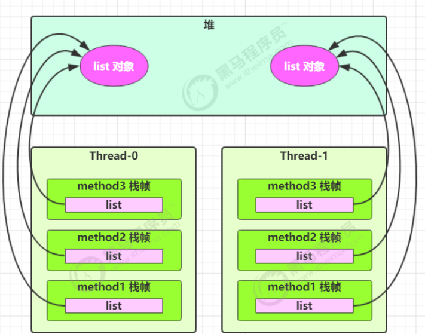

如果修改method2或3的方法为public:

- 其它线程调用也不会出现线程安全问题

原因时调用传入其它的list,不存在共享问题

- 在上面的基础上,为ThreadSafe添加了子类,子类覆盖了m2或m3的方法

这是其它线程再调用调用m2方法,会出现线程安全问题,其它线程非共享局部变量

> private或者final提供安全的意义,开闭原则中的闭

### 3.3.2 线程安全类实例分析

- 例1


- 例2

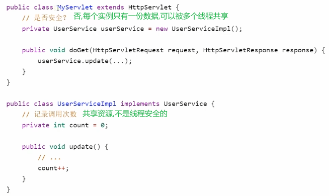

- 例3


环绕通知解决,将成员变量转换成局部变量

- 例4


- 例5


- 例6


- 例7

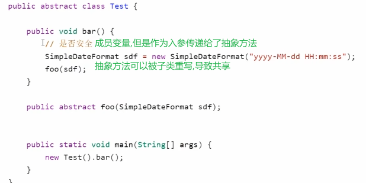

抽象方法foo的行为是不确定的,可能会导致线程不安全,这种方法被称为**外星方法**

## 3.4 常见的线程安全类

- String
- Integer
- StringBuffer
- Random
- Vector
- Hashtable
- java.util.concurrent(juc)包下的类

这里的线程安全是指,多个线程调用他们同一实例的某个方法时,是线程安全的:

- 每个方法都是原子操作,如hashtable加了put中加了synchronized

理解: Hashtable中put方法保证线程安全


- 多个方法的组合不是原子的


get和put单独是原子操作,但是组合起来还是会有线程安全问题:

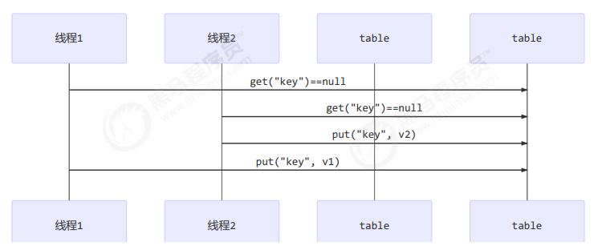

### 3.4.1 不可变类线程安全性

String和Integer都是不可变类,因为其内部状态不可改变(只读不可写),因此他们处于共享状态下也是线程安全的

问题: String有replace,substring方法改变值,这些方法如何保证线程安全?

源码:


解答: 产生一个新的字符串,并赋值,仍然没有改变对象属性


## 3.5 练习

- 买票练习


