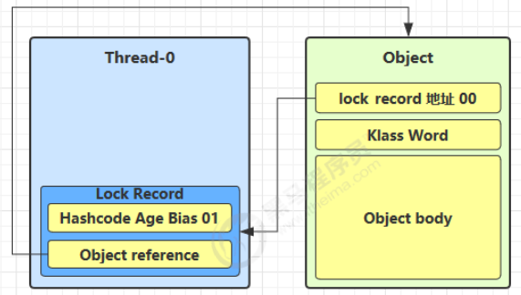

# 框架

>进程和线程
>
>共享模型
>
>非共享模型
>
>并行
>
>其他


[TOC]


# 1 进程和线程

## 1.1 进程和线程的对比

进程

- 计算机执行时的一个实例(程序从磁盘中加载至内存,就开启了一个线程),它包括程序代码和当前的活动(程序运行).
- 进程可以是由多个线程并行执行而组成.
- windows中的进程是不活动的,只是作为线程的容器

线程

- 进程可以是由一个或多个线程组成

- 是一个指令流,将指令流中的指令以一定的顺序交给cpu执行.
- 在java中,线程作为最小的调度单位;进程作为资源分配的最小单位.

对比

- 进程相互独立,线程存在于进程中
- 进程有用于内部共享的资源,如内存空间,供其内部的线程共享
- 进程间通信复杂
  - 同一台计算机内部的进程通信称为 IPC(inter-process communication)
  - 不同计算机间的进程通信,需要通过网络,并遵循协议,如HTTP
- 线程通信相对简单,因为他们共享进程内的内存
- 线程轻量,线程的上下文切换成本比进程上下文切换低

---

## 1.2 并行和并发

### 1.2.1 单核和多核cpu

单核cpu下,**微观串行,宏观并行**:

单核cpu下的线程实际上是串行执行的,操作系统的任务调度组件,把cpu的的执行时间分片(windows下时间片最小约15毫秒),每一个时间片分给不同的程序使用,并切换的速度很快,给人一种同时执行的错觉.


多核cpu下,每个核都可以调度运行程序,此时线程才可以并行执行:


### 1.2.2 并发和并行

rob pike:

- 并发(concurrent)是同一时间应对多件事情的能力
- 并行(parallel)是同一时间动手做多件事情的能力


---

## 1.3 应用

### 1.3.1 多线程异步调用(并发能力)

从调用方的角度:

- 需要等待结果返回,才能继续运行的就是同步
- 不需要等待结果返回,就能继续运行的就是异步

多线程可以让方法的执行变为异步:

​	比如读取磁盘文件,读取消耗的时长如果是同步,那么这段时间内cpu只能等待结果返回

应用:

- 操作费时的任务,可以单独开启一个新线程处理,避免阻塞主线程
- tomcat的异步servlet,让用户线程处理耗时长的操作,避免阻塞tomcat的工作线程


### 1.3.2 多线程提升效率(并行能力)

需要执行的多个计算,最后汇总结果,


- 如果是串行计算,总花费为31ms
- 如果是多核cpu,例如4核,各个核心分别使用不同的线程计算,那么三个线程的计算是并行的,计算时长只取决与最长的那个线程运行时间(11ms),最后再汇总结果,最终只需12ms

> 注意: 并行是需要多核cpu才能提高效率,单核cpu仍然是串行计算

应用:

- 单核cpu下,多线程不能实际提升程序运行效率
- 多核cpu可以并行跑多个线程,但是否提高程序运行效率还是分情况的
  - 有些任务可以拆分,并行执行,可以提升效率
  - 但不是所有的计算任务都可拆分,(如 阿姆达尔定律)
  - 也不是所有的任务都需要拆分,如果任务的目的不同就没有意义了
- io操作不占用cpu,只是我们使用的是**阻塞io**,相当于线程虽然不用cpu,但是需要一直等待io结束(后面的非阻塞io和异步io处理这类问题)

---

# 2 java线程

## 2.1 创建和运行线程

**方式1**: new thread

```java
public static void m1() {
  Thread t1 = new Thread("t1") {
    @Override
    public void run() {
      log.debug("t1 running");
    }
  };
  t1.start();
}
```

**方式2**: 使用runnable配合thread

把任务和线程分离,runnable表示任务,thread表示线程

```java
public static void m2() {
  Runnable r2 = new Runnable() {
    @Override
    public void run() {
      log.debug("t2 running");
    }
  };
  Thread t2 = new Thread(r2, "t2");
  t2.start();
}
```

lambda写法

```java
public static void m2jdk8() {
  Runnable task = () -> log.debug("t2 running");
  Thread t2 = new Thread(task, "t2");
  t2.start();
}
```

小结:

- 使用Runnable更容易与线程池等高级API配合使用
- 用Runnable让任务类脱离Thread的继承体系,更灵活


**方式3**: 使用FutureTask配合Runnable

FutureTask能够接受Callable类型的参数,用来处理带有返回结果的情况

```java
public static void m3() {
  FutureTask<Integer> task = new FutureTask<>(() -> {
    log.debug("t3 running");
    return 100;
  });

  Thread t3 = new Thread(task, "t3");
  t3.start();

  // 主线程注册,等待task执行完毕后返回结果
  Integer result = null;
  try {
    result = task.get();
  } catch (Exception e) {
    throw new RuntimeException(e);
  }
  log.debug("t3 running result" + String.valueOf(result));

}
```

---

## 2.3 线程运行原理

### 2.3.1 栈和栈帧

jvm的虚拟机栈,在每个**线程**启动后,虚拟机都会为其分配一块栈内存

- 每个栈由多个栈帧(Frame)组成,对应着每次方法调用时所占用的内存
- 每个线程只能有一个活动栈帧,对应着当前正在执行的方法

```java
public class FrameTest {
  public static void main(String[] args) {
    method1(10);
  }
  private static void method1(int x) {
    int y = x + 1;
    Object m = method2();
    System.out.println(m);
  }
  private static Object method2() {
    return new Object();
  }
}
```


```java
public class FrameTest {
  public static void main(String[] args) {
    Thread thread = new Thread("t1") {
      @Override
      public void run() {
        method1(20);
      }
    };
    thread.start();

    method1(10);
  }
  private static void method1(int x) {
    int y = x + 1;
    Object m = method2();
    System.out.println(m);
  }

  private static Object method2() {
    return new Object();
  }


}
```


mian线程栈帧运行图示:


### 2.3.2 上下文切换(Thread Context Switch)

由于一些原因,导致cpu不再执行当前线程,转而执行另一个线程的代码

- 线程的cpu时间片用完
- 垃圾回收
- 有更高优先级的线程需要运行
- 线程自己调用了`sleep,yield,wait,join,park,synchronized,lock`等方法

当上下文切换时,需要由操作系统保存当前线程的状态,并恢复另一个线程的状态(线程中的状态有以下几种)

- 程序计数器
- 栈帧信息(如局部变量,操作数栈,返回地址等)

> 注: 程序计数器
>
> 作用是记录下一条jvm指令的执行地址,是线程私有的


## 2.4 线程API

|       方法名        | static |                功能说明                 |                            注意点                            |
| :-----------------: | :----: | :-------------------------------------: | :----------------------------------------------------------: |
|       start()       |        |          启动线程,调用run方法           | start方法只是让线程进入就绪,代码不一定立即执行(等待时间片),每个线程对象的start方法只执行一次,调用多次出现IllegalThreadStateException |
|        run()        |        |           线程实际执行的方法            | 构造Thread时传入Runnable参数,线程启动后会调用Runnable的run方法;也可以创建Thread的之类对象来重写该方法 |
|       join()        |        |            等待线程运行结束             |                                                              |
|    join(long n)     |        |      等待线程运行结束,最多等待n秒       |                                                              |
|       getId()       |        |           获取线程长整型的id            |                            id唯一                            |
| getName()/setName() |        |             获取/修改线程名             |                                                              |
|    getPriority()    |        |             修改线程优先级              | java中规定线程优先级是1-10的整数,较大优先级能提高该线程被cpu调度的几率(不能确保先执行) |
|     getState()      |        |              获取线程状态               | java中的线程状态是由6个enum表示,分别是:NEW,RUNNBALE,BLOCKED,WAITING,TIMED_WAITING,TERMINATED |
|   isInterrupted()   |        |             判断是否被打断              |                        不清除打断标记                        |
|      isAlive()      |        |              线程是否存活               |                                                              |
|     interrupt()     |        |                打断线程                 | 如果被打断的线程正在sleep,wait,join,会导致被打断的线程抛出InterruptedException,并清除打断标记;如果打断的是正在运行的线程,会设置打断标记;park的线程被打断,也会设置打断标记(Thread.*interrupted*()会清除打断标志) |
|    interrupted()    | static |             判断是否被打断              |                        会清除打断标记                        |
|   currentThread()   | static |         获取当前正在执行的线程          |                                                              |
|    sleep(long n)    | static |  让当前执行的线程休眠n毫秒,让出时间片   |                                                              |
|       yield()       | static | 提示线程调度器让出了当前线程对cpu的使用 |                           测试使用                           |


### 2.4.1 start与run

- 直接调用run,是在主线程中执行run方法,并没有启动新线程,方法执行仍然是同步的
- 使用start是启动新线程,通过新线程间接执行run中的代码,异步的

### 2.4.2 sleep与yield

sleep方法:

- 调用sleep会让当前线程从RUNNING进入Timed_Waiting状态(阻塞)

- 其他线程使用睡眠线程的interrupt方法打断正在睡眠的线程,这时的sleep方法会抛出InterruptedException
- 睡眠结束后线程未必立刻得到执行
- 剪影使用TimeUnit的sleep代替Thread的Sleep来获得更高的可读性

yield方法:

- 调用yield会让当前线程从Running进入Runnable就绪状态,然后调度执行其它线程
- 具体的实现依赖于操作系统的任务调度器

vs:

sleep和yield都会让出线程,但是yield仍然有机会获得时间片,而sleep会阻塞,无法参与到时间片的分配

> sleep的小应用,防止cpu占用100%:
>
> 

### 2.4.3 线程优先级

- 线程优先级会**提示**调度器优先调度该线程,但它仅仅只是一个提示,调度器可以忽略
- 如果cpu比较忙,优先级高可能会获得更多的时间片;但是cpu闲时,优先级几乎没有作用

### 2.4.4 join方法

```java
public static void test1() throws InterruptedException {
  Thread t1 = new Thread(() -> {
    try {
      TimeUnit.SECONDS.sleep(1);
      r1 = 10;
    } catch (InterruptedException e) {
      throw new RuntimeException(e);
    }
  }, "t1");

  Thread t2 = new Thread(() -> {
    try {
      TimeUnit.SECONDS.sleep(2);
      r2 = 20;
    } catch (InterruptedException e) {
      throw new RuntimeException(e);
    }
  }, "t2");

  long start = System.currentTimeMillis();
  t1.start();
  t2.start();

  t1.join();
  t2.join();
  long end = System.currentTimeMillis();

  log.debug("r1: {}, r2: {}, cost: {}", r1, r2, end - start);

}
```


`join`方法可以让其它线程等待该线程结束,形成同步关系

**带时效的join**,如下图:


- 线程执行**2s,**只是等待**1.5s,**线程提前结束,程序执行1.5s
- 线程执行**1s,**只是等待**1.5s,**线程提前结束,程序执行1s

### 2.4.5 interrupt

- 打断阻塞状态的线程,会清除打断状态(调用isInterrupted()为false)

> 注
>
> - sleep,wait,join(底层还是wati)会使线程进入阻塞状态,(理想情况下,中断标志置为true)
> - 打断状态,实际上是给线程设置一个**中断标志**,线程仍然会继续运行

```java
// 阻塞线程(sleep, wait, join)打断抛出异常
private static void test1() throws InterruptedException {
  Thread t1 = new Thread("t1") {
    @Override
    public void run() {
      log.debug("enter sleep...");
      try {
        Thread.sleep(2000);
      } catch (InterruptedException e) {
        log.debug("线程打断状态: {}", isInterrupted());
        log.error("wake up...");
        e.printStackTrace();
      }
    }
  };

  t1.start();

  Thread.sleep(1000);

  log.debug("interrupt...");
  t1.interrupt();
  log.debug("线程打断状态: {}", t1.isInterrupted());
}
```


- 打断正常运行的线程,不会清除打断状态,中断标志位true

```java
// 正常线程打断,中断标志为true
private static void test2() throws InterruptedException {
  Thread t1 = new Thread(() -> {
    while (true) {
      Thread current = Thread.currentThread();
      boolean interrupted = current.isInterrupted();
      if (interrupted) {
        log.debug("中断标志: {}", interrupted);
        break;
      }
    }
  }, "t1");

  t1.start();

  TimeUnit.SECONDS.sleep(1);
  t1.interrupt();

}
```
---

#### 模式:interrupt-终止模式之两阶段终止模式

> 在一个线程t1中如何优雅的终止另一个线程t2?t2在进入终止前还能执行一些其它任务后终止

错误实践:

- 使用stop()停止线程

stop()方法会杀死线程,这时如果线程锁住了共享资源,就会造成死锁

- 使用System.exit(int)停止线程

这种会停止整个程序

**两阶段终止模式**

> 场景:
>
> 监控线程,每隔2s记录一次.希望存在一个入口,可以让监控程序暂停


- 使用interrupted

  ```java
  @Slf4j(topic = "c.Monitor")
  class MonitorInterrupted {
  
    private Thread thread;
  
    public void start() {
      thread = new Thread(() -> {
        while (true) {
          Thread current = Thread.currentThread();
          if (current.isInterrupted()) {
            log.debug("料理后事");
            break;
          }
  
          try {
            TimeUnit.SECONDS.sleep(1);
            log.debug("等待1s后保存结果");
          } catch (InterruptedException e) {
            e.printStackTrace();
            // 睡眠时被打断,中断标记为false
            // 重新设置打断标记为true
            current.interrupt();
          }
        }
      }, "监控程序");
  
      thread.start();
    }
  
    public void stop() {
      // 正常运行执行打断,中断标志为true
      thread.interrupt();
    }
  }
  ```

---

- 打断park线程,不会清除中断,但是再次park会失效

使用Thread.interrupted()会清除中断标志,park仍然有效

```java
// 打断park线程,不清除中断
private static void test3() throws InterruptedException {
  Thread t1 = new Thread(() -> {
    log.debug("park...");
    LockSupport.park();
    log.debug("unPark...");
    // log.debug("打断状态: {}...", Thread.currentThread().isInterrupted());
    log.debug("打断状态: {}...", Thread.interrupted());

    // 再次打断
    // isInterrupted()不会清除中断标志,再次使用park会失效
    // Thread.interrupted()会清除中断标志,park仍然有效
    LockSupport.park();
    log.debug("unPark...");

  }, "t1");

  t1.start();

  TimeUnit.MILLISECONDS.sleep(500);
  t1.interrupt();

}
```

### 2.4.6 不推荐使用的api


## 2.5 主线程和守护线程

默认情况下,java进程需要等待所有进程结束,才会退出

有一种特殊的线程称为守护线程,只要当其它的会守护线程运行结束了,即使守护线程的代码没有执行完,都会强制结束

```java
private static void test1() throws InterruptedException {
  Thread t1 = new Thread(() -> {
    while (true) {
      // 线程设置了daemon
      // 其它非守护线程结束,触发interrupt
      if (Thread.currentThread().isInterrupted()) {
        log.debug("结束");
        break;
      }
    }
  }, "t1");

  // 启动前设置守护线程
  t1.setDaemon(true);
  t1.start();

  Thread.sleep(1000);
  log.debug("结束");
}
```

> 注:
>
> 1.垃圾回收器线程就是一种守护线程
>
> 2.tomcat中的Accptor和Poller线程都是守护线程,所有当Tomcat接受到shutdown命令后,不会等他们处理完当前的请求

## 2.6 线程状态

### 2.6.1 五状态模型

> 操作系统层面描述


- 初始状态

仅在代码层面创建了线程对象,没有和操作系统线程关联

- 可运行/就绪状态

线程已经被创建,且和操作系统关联.具备可以被cpu调度执行

- 运行状态

获得了cpu的时间片,处于运行中

当cpu时间片用完,会从运行状态切换到可运行状态(会执行上下文切换)

- 阻塞状态

调用阻塞api,如bio读写文件等,这时线程不用cpu(会执行上下文切换),进入阻塞

等bio操作完毕,会由操作系统唤醒阻塞状态的线程,转至可运行状态

阻塞和可运行状态的区别在于,处于阻塞态的线程,调度器不考虑分配时间片

- 终止状态

表示线程已经执行完毕,生命周期已经结束,状态不会再切换了

### 2.6.2 六状态模型

> 从java api层面描述,根据Thread.State枚举,分为六种状态


- NEW

线程刚被创建,但是没有调用start()方法

- RUNNABLE

调用start()后

> 注:
>
> java api层面的RUNNABLE状态涵盖了操作系统层面的
>
> 可运行状态,运行状态,阻塞状态
>
> (对应bio导致线程的阻塞,在java中无法区分,仍然被认定为是可运行状态)

- BLOCKED,WAITING,TIMED_WAITING

java api层面对阻塞状态的细分

- TERMINATED

当前线程代码运行结束

```java
// NEW 没有调用start方法
Thread t1 = new Thread(() -> {
  log.debug("running");
}, "t1");

// RUNNABLE 运行状态,包括了os的可运行,运行和阻塞状态
Thread t2 = new Thread(() -> {
  while (true) {

  }
}, "t2");
t2.start();

// TERMINATED 运行结束
Thread t3 = new Thread(() -> {

}, "t3");
t3.start();

// TIMED_WAITING 阻塞状态的一种,有时间的阻塞
Thread t4 = new Thread(() -> {
  synchronized (TreadStateTest.class) {
    try {
      TimeUnit.SECONDS.sleep(1000);
    } catch (InterruptedException e) {
      e.printStackTrace();
    }
  }
}, "t4");
t4.start();

// WAITING 阻塞,等待线程2结束(线程2当前在运行)
Thread t5 = new Thread(() -> {
  try {
    t2.join();
  } catch (InterruptedException e) {
    e.printStackTrace();
  }

}, "t5");
t5.start();

// BLOCKED 阻塞,等待获取锁
Thread t6 = new Thread(() -> {
  synchronized (TreadStateTest.class) {
    try {
      Thread.sleep(1000000);
    } catch (InterruptedException e) {
      e.printStackTrace();
    }
  }

}, "t6");
t6.start();
```

---


# 3 共享模型之管程


## 3.1 共享问题

```java
public static void main(String[] args) throws InterruptedException {
  Thread t1 = new Thread(() -> {
    for (int i = 0; i < 15000; i++) {
      count++;
    }
  }, "t1");


  Thread t2 = new Thread(() -> {
    for (int i = 0; i < 15000; i++) {
      count--;
    }
  }, "t2");

  t1.start();
  t2.start();

  t1.join();
  t2.join();

  log.debug("count: {}", count);


}
```

多线程对于**共享资源**的访问,会导致最终的结果可能是正数,负数或者0

分析:

java内存模型中,静态资源(共享)的自增,自减需要在主存和工作内存中进行数据交换


单线程情况下,不会出现问题,共享资源只有一个线程使用

多线程情况下:

出现负数的情况


出现正数的情况


### 3.1.1 临界区

critical section

- 程序运行多线程本身没有问题
- 出现问题在于多个线程访问共享资源
  - 多线程**读**共享资源也没有问题
  - 多线程**读写**共享资源时指令出现交错,会出现问题
- 一段代码内,存在对共享资源的多线程读写操作,称这段代码块为**临界区**

### 3.1.2 竞态条件

多个线程在临界区执行,由于代码的**执行序列不同**而导致结果无法预测,称之为发生了竞态条件,即出现并发问题

为避免临界区的竞态条件的产生,可以使用以下方案解决:

- 阻塞式的解决方案:synchronized,lock
- 非阻塞式的: 原子变量

## 3.2 synchronized

synchronized,又称为**对象锁**.它采用互斥的方式让同一时刻只能有一个线程持有对象锁,其它线程BLOCKED,拥有锁的线程才能执行临界区的代码

> 注:
>
> java中互斥和同步都可以使用synchronized关键字完成,但是区别在于:
>
> - 互斥是保证临界区代码不出现竞态条件,同一时刻只有一个线程执行临界区代码
> - 同步是由于线程执行的先后顺序不同,一个线程需要等待另一个线程运行到某个点


理解synchronized:

- `synchronized(对象)`中的对象,可以理解成房间,进入房间需要锁住门,防止其它人进入
- 当t1执行到synchronized时,表示t1进入房间,并且锁住了门,在门内执行count++
- 当t2执行到synchronized时,发现门被锁住,只能等待(线程上下文切换,状态转为BOLCKED)
- 这是即使t1的时间片用完,被踢出了门外(不要错误理解为锁住的对象就能一直执行,需要时间片),这是门仍然是锁住的,t2还在阻塞,只有下次时间片分配给t1时,t1才能继续执行
- 当t1执行完synchronized中的代码,这时会解锁,唤醒t2线程,t2就可以获得锁,锁住门执行count--

图示:


思考:

> synchronized实际是用**对象锁保证了临界区内代码的原子性**,使得临界区内的代码对外是不可分隔的,不会被线程切换打断

考虑以下几个问题:

- synchronized放在for循环外?

等到for循环(原子)执行结束后才释放锁

- 若t1锁obj1,而t2锁obj2,代码怎样运行?

不同的锁对象不能保证唯一进入

- 如果t1枷锁,而t2没有加?

t2不会被阻塞,不用获取锁对象,仍然不能唯一进入

### 3.2.1 synchronized的其它使用

- 加在成员方法上

相当于锁住this对象


- 加载静态方法上

相对于锁住类对象


### 3.2.2 线程八锁

> 考察synchronized锁住的是哪个对象

- 情况一: 


12或者21

- 情况二:


1s后12,2 1s后1

- 情况三:


3不需要等锁:

32 1s后1(t2先锁)

3 1s后12(t1先锁)

23 1s后1

- 情况四:


不同锁对象:

2 1s后1

- 情况五:


不同锁对象,t1锁类对象,t2锁实例n1:

2 1s后1

- 情况6:


1s后12, 2 1s后1

- 情况七:


不同锁对象:

2 1s后1

- 情况八:


1s后 12, 2 1s后1

---

## 3.3 变量线程安全分析

1. **成员变量和静态变量**是否线程安全

- 如果没有被共享,则线程安全

- 如果被共享了,则根据是否会被改变状态,分为以下两种情况:
  - 如果只有读操作,则线程安全
  - 如果有读写操作,则需要考虑线程安全

2. 局部变量的线程安全性

- 局部变量线程安全

- 但局部变量的**引用对象**未必安全

  - 如果该对象只在方法内作用,则是线程安全的
  - 如果对象方法外也有(return出去了),则需要考虑线程安全

  

### 3.3.1 局部变量线程安全分析

- 局部变量(非引用类型)

每个线程在调用方法时,线程内的栈帧会存放一份局部变量(非引用类型),不存在共享


- 局部变量是引用类型

```java
public class VarUnSafeTest {

  // 启动线程数
  static final int THREAD_NUMBER = 2;

  // 循环次数
  static final int LOOP_NUMBER = 200;

  public static void main(String[] args) {
    ThreadUnsafe test = new ThreadUnsafe();
    for (int i = 0; i < THREAD_NUMBER; i++) {
      new Thread(() -> {
        test.method1(LOOP_NUMBER);
      }, "thread" + i).start();
    }

  }
}

/**
 * 出现的异常分析(ArrayIndexOutOfBoundsException):
 *  线程2还没add
 *  线程1就执行了remove
 */
class ThreadUnsafe {

  // 成员变量,在堆中
  ArrayList<String> list = new ArrayList<>();

  public void method1(int loopNumber) {
    for (int i = 0; i < loopNumber; i++) {
      // 临界区
      method2();
      method3();
    }

  }

  public void method2() {
    list.add("1");
  }

  public void method3() {
    list.remove(0);
  }

}
```

分析:

多个线程对共享资源进行读写


- 将list成员变量修改为局部变量,不存在共享,就没有线程安全问题

```java
/**
 *  两个线程调用method1,会在堆中创建两个局部变量,不存在共享
 */
class ThreadSafe {

  public final void method1(int loopNumber) {
    // 局部变量,在堆中
    ArrayList<String> list = new ArrayList<>();

    for (int i = 0; i < loopNumber; i++) {
      // 临界区
      method2(list);
      method3(list);
    }

  }

  private void method2(List<String> list) {
    list.add("1");
  }

  private void method3(List<String> list) {
    list.remove(0);
  }

}
```


如果修改method2或3的方法为public:

- 其它线程调用也不会出现线程安全问题

原因时调用传入其它的list,不存在共享问题

- 在上面的基础上,为ThreadSafe添加了子类,子类覆盖了m2或m3的方法

这是其它线程再调用调用m2方法,会出现线程安全问题,其它线程非共享局部变量

> private或者final提供安全的意义,开闭原则中的闭

### 3.3.2 线程安全类实例分析

- 例1


- 例2


- 例3


环绕通知解决,将成员变量转换成局部变量

- 例4


- 例5


- 例6


- 例7


抽象方法foo的行为是不确定的,可能会导致线程不安全,这种方法被称为**外星方法**

## 3.4 常见的线程安全类

- String
- Integer
- StringBuffer
- Random
- Vector
- Hashtable
- java.util.concurrent(juc)包下的类

这里的线程安全是指,多个线程调用他们同一实例的某个方法时,是线程安全的:

- 每个方法都是原子操作,如hashtable加了put中加了synchronized

理解: Hashtable中put方法保证线程安全


- 多个方法的组合不是原子的


get和put单独是原子操作,但是组合起来还是会有线程安全问题:


### 3.4.1 不可变类线程安全性

String和Integer都是不可变类,因为其内部状态不可改变(只读不可写),因此他们处于共享状态下也是线程安全的

问题: String有replace,substring方法改变值,这些方法如何保证线程安全?

源码:


解答: 产生一个新的字符串,并赋值,仍然没有改变对象属性

## 3.5 synchronized原理

### 3.5.1 Java对象头

前置知识: java对象头概念,

在32位虚拟机中:


其中Mark Word结构为:


64位虚拟机中,Mark Word结构为:


### 3.5.2 Monitor(锁)

Monitor对象被翻译成监视器或者管程

每个java对象都可以关联一个Monitor对象,

当使用syncronized给对象上锁(重量级)之后,该对象头的Mark Word中就被设置指向Monnitor对象的指针

monitor结构如下:


运行流程:

- 刚开始Monitor中的Owner为null
- 当thread-2执行synchronized(obj)方法时,就会将Monitor的Owner置为thread-2
- 在thread-2上锁后,如果thread-3,-4,-5也来执行synchronized(obj),就会进入EntryList(等待队列) BLOCKED
- thread-2执行完同步代码块的内容后,会唤醒EntryList中等待的线程来竞争锁,竞争是非公平的(先后顺序随机)
- 图中,WaitSet中的thread-0,-1是之前获得过锁,但运行条件不满足进入WAITING状态的线程

> 注:
>
> - synchronized只有锁住同一个对象的monitor才有上述效果
> - 不加synchronized的对象不会关联monitor,没有以上规则

## 3.6 synchronized进阶-优化原理

### 3.6.1 引入,jvm锁升级

故事角色:

- 老王: jvm
- 小南,小女: 线程
- 房间: 对象
- 房间门上-防盗锁: Monitor
- 房间门上-小南书包: 轻量级锁
- 房间门上-刻名字: 偏向锁
- 批量重刻名: 当一个类的偏向锁撤销到达20阈值时,同时切换偏向锁
- 不能刻名字,转为挂书包: 批量撤销该类对象的偏向锁,设置该类为不可偏向

故事内容:


### 3.6.2 轻量级锁

> 轻量级锁的使用场景: 如果一个对象虽然有多个线程访问,但是多线程访问的时间是错开的(没有完全竞争),那么可以使用轻量级锁来优化
>
> 轻量级锁对使用者是透明的,但语法仍然是synchronized

**案例**: 两个同步代码块,利用同一个对象加锁


- method1执行synchronized

1. 创建锁记录(Lock Record)对象,每个线程的栈帧中都会包含一个锁记录的结构,结构内部存储锁定对象的Mark Word


2. 让锁记录中Object reference指向锁对象,并尝试用cas替换Object的Mark Word,将Mark Word的值存入锁记录中


3. 如果cas替换成功,对象头中存储了`锁记录地址和状态 00(normal)`,表示由该线程给对象加锁,


4. 如果cas失败,有两种情况

- 其它线程已经持有了该Object的轻量级锁,这时表明有竞争,进入**锁膨胀过程**
- 如果是自己再次执行synchronized锁重入(method2),那么再添加一条Lock Record作为重入的计数


5. 当退出synchronized(解锁时),如果有取值为null的锁记录,表示有重入,这时重置锁记录,表示重入计数减一



6. 当退出synchronized(解锁时),锁记录的值不为null,这是使用cas将Mark Word的值恢复给对象头

- 成功,则解锁成功
- 失败,说明轻量级锁进行了锁膨胀,或者已经**升级**为重量锁,进入重量级锁解锁流程

### 3.6.3 锁膨胀

如果再尝试加轻量级锁的过程中,cas操作无法操作成功,这时的一种情况就是有**其它线程为此对象加上了轻量级锁**(有竞争),这是需要进行锁膨胀,将轻量级锁变为重量级锁


- 当Thread-1进入轻量级加锁时,thread-0已经对该对象加了轻量级锁


- 这时thread-1加轻量级锁失败,进入锁膨胀流程

  - 即为Objecy对象申请Monitor锁,让Object指向重量级锁地址
  - 然后将thread1加入到monitor的entrylist队列中,进入BLOCKED状态

  

- 当thread-0退出同步代码块解说时,使用cas将mark word的值恢复给对象头,失败.这是会进入重量级锁解锁流程,即按照Monitor地址找到Monitor对象,设置Owner为null,泛型entry list中BOLCKED线程

### 3.6.4 自旋重试优化

重量级锁竞争时,还可以使用自旋来进行优化,如果当前线程自旋成功(即这时候持锁线程已经退出了同步代码块,释放了锁),这时当前线程就可以避免阻塞

- 自旋重试成功的情况


- 自旋重试失败的情况


>注:
>
>- 自旋会占用cpu时间,单核cpu自旋就是浪费资源,且没有必要(单个cpu没有多余资源给线程自旋使用),多核cpu自旋才能发挥优势
>- 再java6之后自旋锁是自适应的(比如对象刚刚一次自选操作成功过,那么认为这次自旋成功的可能性会更高,就会多自旋几次;反之,就会少自旋或者不自旋)
>- java7之后不能控制是否开启自旋功能

### 3.6.5 偏向锁

轻量级锁在没有竞争时(就自己这个线程),每次重入仍然需要执行cas操作

java6中引入了偏向锁来做进一步优化:

- 只有第一次使用cas,将线程id设置到对象的mark word头中
- 之后发现这个线程id是自己的就表示没有竞争,不用重新cas,以后只要不发生竞争,这个对象就归该线程所有

例如:


1. 轻量级锁情况下


2. 偏向锁情况下


#### 3.6.5.1 偏向状态

- 对象头的mark word


当一个对象创建时:

- 如果开启了偏向锁(默认开启),那么对象创建后,markdown值为0x05,即最后3位为101,这时它的thread,epoch,age都为0
- 偏向锁是默认是延迟的,不会再程序启动时立即生效,如果想避免延迟,可以增加vm参数`-xx:BiasedLockingStartupDelay=0`
- 如果没有开启偏向锁,那么对象创建后,markword值为0x01,即最后3位为001,这是它的hashcode,age都为0,第一次用到hashcode时才会赋值

实践:

- 测试偏向锁

默认启用偏向锁,设置偏向锁延迟时间为0`xx:BiasedLockingStartupDelay=0`,

默认创建对象是家偏向锁的

```java
 // 创建可偏向对象
Dog dog = new Dog();
String printable = ClassLayout.parseInstance(dog).toPrintable();
log.debug(printable);

// 偏向锁延迟特性
Thread.sleep(4000);
log.debug(ClassLayout.parseInstance(new Dog()).toPrintable());

// 加偏向锁
synchronized (dog) {
  // 00101010101110001001110000010110000000000101
  // 最后还是101
  // 前面是os给线程赋的id
  log.debug(ClassLayout.parseInstance(dog).toPrintable());
}
// 后续mark word都是添加偏向锁
log.debug(ClassLayout.parseInstance(dog).toPrintable());
```

mark word分析:

第一次打印,


0x0000000000000005 --> 101: Baised偏向锁

第二次打印,和上面一样

第三次打印,加synchronized后,


0x000002ab89c16005 --> 101010101110001001110000010110000000000 101: 仍然是偏向锁;前面的地址分配了os给的线程id

第四次打印,和上面一样,

处于偏向锁的对象解锁后,线程id仍存储在对象头中

- 测试偏向锁禁用

`-XX:-UseBiasedLocking `


打印测试,后三位都是001,normal状态

只有当加synchronized,才会升级成功轻量级锁

#### 3.6.5.2 撤销偏向锁的三种情况

1. 调用hashcode

注意,调用hashcode后,会撤销对象的偏向锁,恢复为正常状态,原因在31的hashcode在有偏向锁的对象中无法存入,只能移除偏向锁腾出位置(轻量级锁和重量级锁没有这个问题,存储位置不在mark word)

- 轻量级锁会在锁记录中记录hashcode
- 重量级锁会在Monitor中记录hashcode

调用hashcode实践:


001(正常) --> 000(轻量级) --> 001(正常)

2. 其它线程使用对象

当有其它线程使用偏向锁对象时,会将偏向锁升级为轻量级锁

```java
// 创建可偏向对象
Dog2 dog = new Dog2();


new Thread(() -> {
  log.debug(ClassLayout.parseInstance(dog).toPrintable());
  synchronized (dog) {
    log.debug(ClassLayout.parseInstance(dog).toPrintable());
  }
  log.debug(ClassLayout.parseInstance(dog).toPrintable());

  synchronized (WithdrawBiasedTest.class) {
    WithdrawBiasedTest.class.notify();
  }

}, "t1").start();

new Thread(() -> {

  synchronized (WithdrawBiasedTest.class) {
    try {
      WithdrawBiasedTest.class.wait();
    } catch (InterruptedException e) {
      throw new RuntimeException(e);
    }
  }

  log.debug(ClassLayout.parseInstance(dog).toPrintable());
  synchronized (dog) {
    log.debug(ClassLayout.parseInstance(dog).toPrintable());
  }
  log.debug(ClassLayout.parseInstance(dog).toPrintable());
}, "t2").start();
```

分析:


t1,t2线程交错执行,

t1先执行,正常偏向锁的逻辑

当唤醒t2执行时,由偏向锁转换成轻量级锁,最后解锁恢复正常状态

3. 调用wait/notify

```java
// 创建可偏向对象
Dog3 dog = new Dog3();


new Thread(() -> {
  log.debug(ClassLayout.parseInstance(dog).toPrintable());
  synchronized (dog) {
    log.debug(ClassLayout.parseInstance(dog).toPrintable());
    try {
      //
      dog.wait();
    } catch (InterruptedException e) {
      throw new RuntimeException(e);
    }
  }
  log.debug(ClassLayout.parseInstance(dog).toPrintable());

}, "t1").start();

new Thread(() -> {

  synchronized (WithdrawBiasedTest.class) {
    try {
      Thread.sleep(6000);
    } catch (InterruptedException e) {
      throw new RuntimeException(e);
    }
  }

  synchronized (dog) {
    log.debug("notify");
    dog.notify();
  }
}, "t2").start();
```

分析:


t1正常执行为偏向锁,直到notify后,轻量级锁转换为正常

#### 3.6.5.3 批量重偏向

如果对象虽然被多个线程访问,但没有竞争,这时偏向了线程t1的对象仍有机会重新偏向t2,重偏向会重置对象的thread id

当撤销偏向锁阈值超过20次后,jvm会觉得偏向错误(一开始偏向t1,但总是撤销,是不是应该给t2),于是再给这些对象加锁是重新偏向至加锁线程

实践:


都是偏向锁,但是thread id改变了

#### 3.6.5.4 批量撤销

当撤销偏向锁阈值超过40次后,jvm会觉得的确是偏向错误,根本就不该偏向.于是整个类的所有对象都会变为不可偏向,新建的对象也是不可偏向的

实践:


### 3.6.6 锁消除

演示代码(锁消除):


默认开启锁消除:


jit:即时编译器,在发现b方法的锁对象不存在竞争时,会消除加锁部分的代码

关闭锁消除:


---

## 3.7 wait/notify

- 引入

wait的场景,小故事


- 原理


分析:

- Owner线程发现条件不满足,调用wait方法,就可以进入watiset变为WAITING状态
- BLOCKED和WAITING的线程都处于阻塞状态,不占用cpu时间片
- BLOCKED线程会在Owner线程释放锁时唤醒
- WAITING线程会在Owner线程调用notifyAll时唤醒,但唤醒后并不意味着立刻会的锁,仍然需要进入entrylist中重新竞争

### 3.7.1 api

- obj.wait(): 让进入object监视器的线程到waitset中等待
  - wait(): 方法会是释放对象的锁,进入waitset等待区,从而让其它线程有机会获得对象的锁,且没有等待时间限制,知道notify为止
  - wait(long n): 有时限的等待,到n毫秒后结束等待,或是被notify
- obj.notify(): 在object上正在waitset等待的线程中挑选一个唤醒
- obj.notifyAll(): 让object上正在waitset等待的线程全部唤醒

> 注:
>
> - 上述api都是线程间进行协作的手段,都属于Object对象的方法
> - 且必须获得此对象的锁,才能调用这几个方法

```java
// 锁对象最好用final修饰一下
final static Object OBJ = new Object();

new Thread(() -> {
  synchronized (OBJ) {
    log.debug("执行...");
    try {
      OBJ.wait();
    } catch (InterruptedException e) {
      throw new RuntimeException(e);
    }
    log.debug("其它代码继续继续...");

  }
}, "t1").start();

new Thread(() -> {
  synchronized (OBJ) {
    log.debug("执行...");
    try {
      OBJ.wait();
    } catch (InterruptedException e) {
      throw new RuntimeException(e);
    }
    log.debug("其它代码继续继续...");
  }
}, "t2").start();


// 主线程
log.debug("主线程执行中...");
Thread.sleep(2000);
log.debug("唤醒obj上的其它线程");
synchronized (OBJ) {
  //            obj.notify();
  OBJ.notifyAll();
}
```

### 3.7.2 wait,notify的正确使用方式

- 对比sleep(long n)和wait(long n)的区别

1. sleep是thread的方法,而wait是object的方法
2. sleep不需要强制和synchronized配合使用,但是wait需要在synchronized内部使用
3. sleep在睡眠时,是不需要释放锁的,但**wait在等待的是否会释放对象锁**
4. 他们的状态都是TIMED_WAITING

#### 3.7.2.1 方案1

```java
// 锁对象最好用final修饰一下
final static Object ROOM = new Object();
static boolean hasCigarette = false;
static boolean hasTakeout = false;

public static void main(String[] args) throws InterruptedException {
  new Thread(() -> {
    synchronized (ROOM) {
      log.debug("有烟没? [{}]", hasCigarette);
      if (!hasCigarette) {
        log.debug("没烟,先歇会儿!");
        try {
          Thread.sleep(2000);
        } catch (InterruptedException e) {
          throw new RuntimeException(e);
        }
      }
      log.debug("有烟没? [{}]", hasCigarette);
      if (hasCigarette) {
        log.debug("可以开售干活了...");
      }

    }

  }, "小南").start();

  for (int i = 0; i < 5; i++) {
    new Thread(() -> {
      synchronized (ROOM) {
        log.debug("可以开售干活了...");
      }
    }, "其他人" + i).start();
  }

  Thread.sleep(1000);

  new Thread(() -> {
    hasCigarette = true;
    log.debug("烟到了哦");
  }, "送烟的").start();
}
```

分析:

- 其它线程会被一直阻塞,直到小南线程等烟工作完后
- 小南线程必须睡眠2s后才能醒来,就算烟提前送到,也无法立刻醒来
- 使用wait-notify机制解决该问题

#### 3.7.2.2 方案2

```java
public static void main(String[] args) throws InterruptedException {
  new Thread(() -> {
    synchronized (ROOM) {
      log.debug("有烟没? [{}]", hasCigarette);
      if (!hasCigarette) {
        log.debug("没烟,先歇会儿!");
        try {
          //                        Thread.sleep(2000);
          ROOM.wait(2000);
        } catch (InterruptedException e) {
          throw new RuntimeException(e);
        }
      }
      log.debug("有烟没? [{}]", hasCigarette);
      if (hasCigarette) {
        log.debug("可以开售干活了...");
      }

    }

  }, "小南").start();

  for (int i = 0; i < 5; i++) {
    new Thread(() -> {
      synchronized (ROOM) {
        log.debug("可以开售干活了...");
      }
    }, "其他人" + i).start();
  }

  Thread.sleep(1000);

  new Thread(() -> {
    //            hasCigarette = true;
    //            log.debug("烟到了哦");

    synchronized (ROOM) {
      hasCigarette = true;
      log.debug("烟到了哦");
      ROOM.notify();
    }
  }, "送烟的").start();
}
```

分析:

- 解决了其它干活的线程阻塞问题
- 但如果其它线程也有等待条件呢?

#### 3.7.2.3 方案3

```java
public static void main(String[] args) throws InterruptedException {
  new Thread(() -> {
    synchronized (ROOM) {
      log.debug("有烟没? [{}]", hasCigarette);
      if (!hasCigarette) {
        log.debug("没烟,先歇会儿!");
        try {
          //                        Thread.sleep(2000);
          ROOM.wait(2000);
        } catch (InterruptedException e) {
          throw new RuntimeException(e);
        }
      }
      log.debug("有烟没? [{}]", hasCigarette);
      if (hasCigarette) {
        log.debug("可以开售干活了...");
      } else {
        log.debug("没干成活...");
      }

    }

  }, "小南").start();


  new Thread(() -> {
    synchronized (ROOM) {
      log.debug("外卖送到没? [{}]", hasTakeout);
      if (!hasTakeout) {
        log.debug("没外卖,先歇会儿!");
        try {
          ROOM.wait();
        } catch (InterruptedException e) {
          throw new RuntimeException(e);
        }
      }
      log.debug("外卖送到没? [{}]", hasTakeout);
      if (hasTakeout) {
        log.debug("可以开售干活了...");
      } else {
        log.debug("没干成活...");
      }
    }
  }, "小女").start();

  for (int i = 0; i < 5; i++) {
    new Thread(() -> {
      synchronized (ROOM) {
        log.debug("可以开售干活了...");
      }
    }, "其他人" + i).start();
  }

  Thread.sleep(1000);

  new Thread(() -> {
    //            hasCigarette = true;
    //            log.debug("烟到了哦");

    synchronized (ROOM) {
      // 希望叫醒小南,但是有可能会把小女唤醒,但是小女仍然不满足执行条件(虚假唤醒)
      hasCigarette = true;
      log.debug("烟到了哦");
      ROOM.notify();
    }
  }, "送烟的").start();
}
```

分析:

- notify只能随机唤醒一个waitset中的线程,这时如果有其它线程也在等待,那么就可能唤醒不了正确的线程,称之为**虚假唤醒**

- 希望叫醒小南,但是有可能会把小女唤醒,但是小女仍然不满足执行条件(**虚假唤醒**)

- 解决方法,使用notifyAll

#### 3.7.2.4 方案4

改为notifyall唤醒

```java
new Thread(() -> {
  synchronized (ROOM) {
    hasCigarette = true;
    log.debug("烟到了哦");
    ROOM.notifyAll();
  }
}, "送烟的").start();
```

- 使用notifyall仅能解决某个线程的唤醒问题
- 但是if+wait判断仅有一次机会,一旦条件不成立,不能重新唤醒
- 使用while+wait的方式,但条件不成立时,再次wait

#### 3.7.2.5 方案5

改为while循环,多次判断

```java
new Thread(() -> {
  synchronized (ROOM) {
    log.debug("有烟没? [{}]", hasCigarette);
    //                if (!hasCigarette) {
    while (!hasCigarette) {
      log.debug("没烟,先歇会儿!");
      try {
        //                        Thread.sleep(2000);
        ROOM.wait(2000);
      } catch (InterruptedException e) {
        throw new RuntimeException(e);
      }
    }
    log.debug("有烟没? [{}]", hasCigarette);
    if (hasCigarette) {
      log.debug("可以开售干活了...");
    } else {
      log.debug("没干成活...");
    }

  }

}, "小南").start();


new Thread(() -> {
  synchronized (ROOM) {
    log.debug("外卖送到没? [{}]", hasTakeout);
    //                if (!hasTakeout) {
    while (!hasTakeout) {
      log.debug("没外卖,先歇会儿!");
      try {
        ROOM.wait();
      } catch (InterruptedException e) {
        throw new RuntimeException(e);
      }
    }
    log.debug("外卖送到没? [{}]", hasTakeout);
    if (hasTakeout) {
      log.debug("可以开售干活了...");
    } else {
      log.debug("没干成活...");
    }
  }
}, "小女").start();

for (int i = 0; i < 5; i++) {
  new Thread(() -> {
    synchronized (ROOM) {
      log.debug("可以开售干活了...");
    }
  }, "其他人" + i).start();
}

Thread.sleep(1000);

new Thread(() -> {
  //            hasCigarette = true;
  //            log.debug("烟到了哦");

  synchronized (ROOM) {
    hasCigarette = true;
    log.debug("烟到了哦");
    //                ROOM.notify();
    ROOM.notifyAll();
  }
}, "送烟的").start();
```

#### 3.7.2.6 最佳方案

```java
synchronized(lock) {
	while(条件不成立) {
    lock.wait();
  }
  // 正常逻辑
}

// 唤醒线程
synchronized(lock) {
	lock.notifyAll();
}
```

### 3.7.3 ==同步模式: 保护性暂停==

- 定义

即guarded suspension,用在一个线程等待另一个线程的执行结果;

要点:

1. 有一个结果需要从另一个线程传递到另一个线程,让他们关联同一个guarded object
2. 如果有结果不断的从一个线程到另一个线程,那么可以使用消息队列(生产者/消费者)
3. jdk中,**join**的实现,**future**的实现,采用的就是此模式
4. 因为要等待另一方的结果,因此归类为**同步模式**


#### 3.7.3.1 普通版本实现

```java
private final Object LOCK = new Object();

private Object response;

public static void main(String[] args) {
  GuardSuspension guardSuspension = new GuardSuspension();

  new Thread(() -> {
    try {
      List<String> resp = Downloader.download();
      log.debug("download complete...");
      guardSuspension.complete(resp);
    } catch (IOException e) {
      throw new RuntimeException(e);
    }
  }, "子线程").start();

  log.debug("waiting...");
  // 主线程阻塞等待
  Object resp = guardSuspension.get();
  log.debug("get response: [{}] lines", ((List<String>) resp).size());


}

public Object get() {
  synchronized (LOCK) {
    while (response == null) {
      try {
        LOCK.wait();
      } catch (InterruptedException e) {
        e.printStackTrace();
      }
    }
    return response;
  }
}

public void complete(Object response) {
  synchronized (LOCK) {
    this.response = response;
    LOCK.notifyAll();
  }
}

```

Downloader类:

```java
public class Downloader {
  public static List<String> download() throws IOException {
    HttpURLConnection conn = (HttpURLConnection) new URL("https://www.baidu.com/")
      .openConnection();
    List<String> lines = new ArrayList<>();
    try (BufferedReader reader =
         new BufferedReader(new InputStreamReader(conn.getInputStream(), StandardCharsets.UTF_8))) {
      String line;
      while ((line = reader.readLine()) != null) {
        lines.add(line);
      }
    }
    return lines;
  }
}
```


#### 3.7.3.2 超时版本实现

比如下载很慢,超过时间后就不等待了

```java
public static void main(String[] args) {
  GuardSuspensionV2 guardSuspension = new GuardSuspensionV2();

  new Thread(() -> {
    try {
      TimeUnit.SECONDS.sleep(1);
      guardSuspension.complete(null);
      TimeUnit.SECONDS.sleep(1);
      guardSuspension.complete(Arrays.asList("a", "b", "c"));
    } catch (InterruptedException e) {
      throw new RuntimeException(e);
    }
  }, "子线程").start();

  log.debug("waiting...");
  // 主线程阻塞等待
  //        Object resp = guardSuspension.get(1500);
  Object resp = guardSuspension.get(2500);
  if (resp != null) {
    log.debug("get response: [{}] lines", ((List<String>) resp).size());
  } else {
    log.debug("can't get  response");
  }


}

public Object get(long mills) {
  synchronized (LOCK) {
    // 记录时间
    long begin = System.currentTimeMillis();
    long timePasswd = 0;
    while (response == null) {
      // 多次进入循环
      // 记录剩余还需要等待的时间
      long waitTime = mills - timePasswd;
      log.debug("waitTime: {}", waitTime);
      // 超过等待时间,退出循环,不再等待
      if (waitTime <= 0) {
        log.debug("break...");
        break;
      }
      try {
        // 动态更新等待时间
        LOCK.wait(waitTime);
      } catch (InterruptedException e) {
        e.printStackTrace();
      }
      // 如果被提前唤醒,这是已经经历的时间假设为 400
      timePasswd = System.currentTimeMillis() - begin;
      log.debug("timePassed: {}, object is null: {}", timePasswd, response == null);
    }
    return response;
  }
}

public void complete(Object response) {
  synchronized (LOCK) {
    this.response = response;
    LOCK.notifyAll();
  }
}
```


#### 3.7.3.3 join原理: 等价于超时版本实现

- 保护性暂停模式

用调用者轮询检查线程alive状态


#### 3.7.3.4 多任务版实现

- 一一对应的生产者消费者


分析:

如果需要在多个类之间使用GuardedObject对象,作为参数传递不是很方便,因此设计一个**用来解耦的中间类**,这样不仅能够解耦 [结果等待者]和 [结果生产者],还能够同时支持多个任务的管理

```java
/**
 * 中间解耦类
 *
 * @author qlk
 * @see GuardSuspensionV3
 */
public class MailBoxes {
  // 线程安全-hashtable
  private static Map<Integer, GuardSuspensionV3> boxes = new Hashtable<>();

  private static int id = 1;

  // 产生唯一id,线程安全-synchronized
  public static synchronized int generateId() {
    return id++;
  }

  public static GuardSuspensionV3 getGuardSuspensionV3(int id) {
    return boxes.remove(id);
  }

  public static GuardSuspensionV3 createGuardSuspensionV3() {
    GuardSuspensionV3 guard = new GuardSuspensionV3(generateId());
    boxes.put(guard.getId(), guard);
    return guard;
  }

  public static Set<Integer> getIds() {
    return boxes.keySet();
  }
}

// people
public class People extends Thread {
  @Override
  public void run() {
    // 收信
    GuardSuspensionV3 guard = MailBoxes.createGuardSuspensionV3();
    log.debug("开始收信 id: {}", guard.getId());
    Object mail = guard.get(5000);
    log.debug("收信成功 id: {}, 内容为: {}", guard.getId(), mail);

  }
}

// postman
public class Postman extends Thread {
  private int id;
  private String mail;

  public Postman(int id, String mail) {
    this.id = id;
    this.mail = mail;
  }

  @Override
  public void run() {
    GuardSuspensionV3 guard = MailBoxes.getGuardSuspensionV3(id);
    log.debug("送信 id: {}, 内容: {}", id, mail);
    guard.complete(mail);
  }
}
```

> - 生产者people和消费者postman一一对应,每个生产者都有唯一的消费者处理
> - rpc框架中常使用
>
> - MailBoxes是比较通用的类


### 3.7.4 ==异步模式: 异步模式之生产者消费者==

定义:

- 与前面的保护性暂停中的GuardObject不同,不需要产生结果和消费结果的线程一一对应
- 中间的消息队列,可以用来平衡生产和消费的线程资源
- 生产者只负责产生数据结果,不关心数据如何处理,而消费者专心处理结果数据
- 消息队列是有容量限制的,满时不会再加入数据,空时不会再消耗数据
- jdk中的各种阻塞队列,采用的就是这种模式


实现:

```java
// 生产者消息者-消息队列
public class MessageQueue {
  private LinkedList<Message> queue;
  private int capacity;

  public MessageQueue(int capacity) {
    this.capacity = capacity;
    queue = new LinkedList<>();
  }

  public void put(Message message) {
    synchronized (queue) {
      while (queue.size() == capacity) {
        log.debug("库存已经达到上限, wait...");
        try {
          queue.wait();
        } catch (InterruptedException e) {
          e.printStackTrace();
        }
      }
      queue.addLast(message);
      queue.notifyAll();
    }
  }

  public Message take() {
    synchronized (queue) {
      while (queue.isEmpty()) {
        log.debug("没货了, wait...");
        try {
          queue.wait();
        } catch (InterruptedException e) {
          e.printStackTrace();
        }
      }
      Message message =queue.removeFirst();
      queue.notifyAll();
      return message;
    }
  }

  public static void main(String[] args) { 
    MessageQueue messageQueue = new MessageQueue(2);
    // 4个生产者
    for (int i = 0; i < 4; i++) {
      int id = i;
      new Thread(() -> {

        try {
          log.debug("download...");
          List<String> resp = Downloader.download();
          log.debug("try put message({})...", id);
          messageQueue.put(new Message(id, resp));
        } catch (IOException e) {
          e.printStackTrace();
        }
      }, "生产者" + i).start();
    }

    // 1个消费者
    new Thread(() -> {
      while (true) {
        Message message = messageQueue.take();
        List<String> response = (List<String>) message.getMessage();
        log.debug("take message({}): [{}] lines", message.getId(), response.size());
      }
    }, "消费者").start();
  }
}

// 消息实体
class Message {
  private int id;
  private Object message;

  public Message(int id, Object message) {
    this.id = id;
    this.message = message;
  }

  public int getId() {
    return id;
  }

  public Object getMessage() {
    return message;
  }
}
```

分析:


---

## 3.8 park/unpark

1. 基本使用:

他们都是LockSupport类中的方法

```java
// 暂停某个线程
LockSupport.park();

// 恢复某个线程的运行
LockSupport.unpark("暂停线程的对象");
```

先park,再unpark:

```java
public static void main(String[] args) throws InterruptedException {
  Thread t1 = new Thread(() -> {
    try {
      log.debug("start");
      TimeUnit.SECONDS.sleep(1);
      log.debug("park...");
      log.debug("resume...");
    } catch (InterruptedException e) {
      throw new RuntimeException(e);
    }

  }, "t1");
  t1.start();

  TimeUnit.SECONDS.sleep(2);
  log.debug("unpark...");
  LockSupport.unpark(t1);
}
```

先unpark再park:

```java
public static void main(String[] args) throws InterruptedException {
  Thread t1 = new Thread(() -> {
    try {
      log.debug("start");
      TimeUnit.SECONDS.sleep(2);
      log.debug("park...");
      log.debug("resume...");
    } catch (InterruptedException e) {
      throw new RuntimeException(e);
    }

  }, "t1");
  t1.start();

  TimeUnit.SECONDS.sleep(1);
  log.debug("unpark...");
  LockSupport.unpark(t1);
}
```


2. 要点

与Object的wait和notify相比

- wait,notify和notifyAll必须配合Object Monitor一起使用,而park,unpark不必
- park和unpark是以线程为单位来阻塞和唤醒线程;
- 而notify只能随机唤醒一个等待线程,notifyAll是唤醒所有等待的线程,不用那么明确
- park和unpark可以先unpark,而wait和notify不可以先notify

### 3.8.1 原理-park&unpark的原理

park和unpark底层是native方法

每个线程都有自己的一个Parker对象,由三部分组成,`_counter`,`_cond`和`_mutex`

- 比喻线程是一个旅行者,Parker就像他随身携带的背包,`_cond`条件变量是背包里的帐篷,`_counter`就好比是背包中的干粮(0为耗尽,1为充足)

- 调用park就是要看是否需要停下来休息

  - 如果备用干粮充足,就唤醒让他继续前进
  - 如果备用干粮耗尽,就需要休息

- 调用unpark,就是补充一次干粮

  - 如果这是线程还在休息,就唤醒他
  - 如果这时线程还在运行,那么下次他调用park时,仅是消耗备用干粮,不需要停留继续前进(背包空间有限,多次调用unpark仅会补充一份备用干粮)

  ---

  

调用park时:

- 当前线程调用UNSAFE.park()方法
- 检查`_counter`,本情况为0,这时获得`_mutex`互斥锁
- 线程进入`_cond`条件变量队列阻塞
- 设置`_counter`=0


调用unpark时:

- 调用UNSAFE.unpark(thread_0)方法,设置`_counter`为1
- 唤醒`_cond`条件变量中的Thread_0
- Thread_0恢复运行
- 设置`_counter`为0


先调用unpark后再调用park方法:

- unpark会是的`_counter`为1
- 当前线程调用UNSAFE.park()方法
- 检查`_counter`,本情况为1,这是线程无需阻塞,**继续运行**
- 重新设置`_counter`=0


---

## 3.9 重新理解线程状态转换


假设有线程Thread t

### 情况1: NEW-->RUNNABLE

- 当调用t.start()

### 情况2: RUNNABLE-->WAITING

t线程使用`synchronized(obj)`获取对象锁后:

- t对象使用`obj.wait()`方法时,t线程从RUNNABLE-->WAITING
- 调用`obj.notifyAll()`,`obj.notify()`,`obj.interrupt()`时:
  - 竞争锁成功,t线程从WAITING-->RUNNABLE
  - 竞争锁失败,t线程从WAITING-->BOLCKED

### 情况3: RUNNABLE-->WAITING

- 主线程调用`其它线程.join()`方法,主线程从RUNNABLE-->WAITING
  - 注意时主线程是在其它线程对象的监视器上等待
- 其它线程t运行结束后,或者调用了主线程的interrupt()时,主线程从WAITING-->RUNNABLE

### 情况4: RUNNABLE-->WAITING

- 当前线程调用`LockSupport.park()`方法,会让当前线程从`RUNNABLE-->WAITING`
- 调用`unpark(目标线程)`方法,或者调用了目标线程的`interrupt()`,会让目标线程从`WAITING-->RUNNABLE`

### 情况5: RUNNABLE-->TIMED_WAITING

t线程使用synchronized(obj)获得了对象锁后:

- 调用obj.wait(long n)`有时限`方法,t线程从RUNNABLE-->TIMED_WAITING
- t线程等待时间超过n毫秒,或者调用`obj.notify(), obj.notifyAll(), t.interrupt()`时
  - 竞争锁成功,t线程从TIMED_WAITING-->RUNNABLE
  - 竞争锁失败,t线程从TIMED_WAITING-->BOLCKED

### 情况6: RUNNABLE-->TIMED_WAITING

- 当前线程调用`t.join(long n)`方法时,当前线程从RUNNABLE-->TIMED_WAITING
  - 当前线程在t线程对象的监视器上等待
- 当前线程等待超过n毫秒,或者t线程运行结束,或者调用了当前线程的interrupt()时,当前线程从TIMED_WAITING-->RUNNABLE

### 情况7: RUNNABLE-->TIMED_WAITING

- 当前线程调用`Thread.sleep(long n)`,当前线程从RUNNABLE --> TIMED_WAITING
- 当前线程睡眠n毫秒后,当前线程从 TIMED_WAITING --> RUNNABLE

### `情况8: RUNNABLE-->TIMED_WAITING

- 当前线程调用`LockSupport.parkNanos(long nanos)`,或者时`parkUntil(long mills)`时,当前线程会从RUNNABLE-->TIMED_WAITING
- 当调用`LockSupport.unpark(目标线程)`,或者调用了线程的`interrupt()`, 或者`等待超时`,会让目标线程从TIMED_WAITING --> RUNNABLE

### 情况9: RUNNABLE-->BLOCKED

- t线程用synchronized(obj)获取对象锁时,如果竞争失败,从RUNNABLE-->BOLCKED
- 持有obj锁的线程同步代码块执行完毕,会唤醒该对象监视器上所有BLOCKED的线程重新竞争,如果其中t线程竞争成功,会从BLOCKED --> RUNNABLE,其它失败的线程仍然BLOCKED

### 情况10: RUNNABLE-->TERMINATED

当前线程所有代码运行完毕,进入terminated


## 3.10 细粒度锁-多把锁

多把不相干的锁

一间大屋子可以有两个多个功能,比如说: 学习,睡觉; 他们互不相干

现在小南要学习,小女要睡觉,如果使用同一把对象锁,并发度会很低

- 解决方案是使用多把锁

案例:

- 一把锁的情况:


同时启用小南,小女线程,结果为:


- 多把锁的情况:


结果为:


将锁的粒度细分:

- 好处,可以增强并发度
- 坏处,如果一个线程需要同时获得多把锁,容易造成死锁


## 3.11 活跃性-死锁问题

### 3.11.1 死锁

一个线程需要同时获取多把锁,这是就容易发生死锁

例子: t1线程获取a对象的锁,之后想获取b线程的锁,但是b线程正在被t2线程使用,同时t2线程也需要a对象的锁

```java
public static void main(String[] args) {

  Object A = new Object();
  Object B = new Object();


  Thread t1 = new Thread(() -> {
    synchronized (A) {
      try {
        log.debug("lock a");
        TimeUnit.SECONDS.sleep(1);
        synchronized (B) {
          log.debug("lock b");
          log.debug("操作...");
        }
      } catch (InterruptedException e) {
        e.printStackTrace();
      }
    }
  }, "t1");

  Thread t2 = new Thread(() -> {
    synchronized (B) {
      try {
        log.debug("lock b");
        TimeUnit.SECONDS.sleep(1);
        synchronized (A) {
          log.debug("lock a");
          log.debug("操作...");
        }
      } catch (InterruptedException e) {
        e.printStackTrace();
      }
    }
  }, "t2");

  t1.start();
  t2.start();

}
```


### 3.11.2 定位死锁

- 检查死锁可以使用jconsole
- 或者使用jps定位进程id,再使用jstack定位死锁


或者在最后,会有死锁的信息


死锁的避免:

- 避免死锁要注意加锁顺序
- 另外如果某个线程进入了死循环,导致其它线程一直等待,对于这种情况linux下可以通过top定位CPU占用高的java线程,再利用 `top -Hp 进程id`来定位是哪个线程,最后再使用jstack排查该线程

### 3.11.3 哲学家就餐问题

死锁典型案例

### 3.11.4 活锁

活锁出现在两个线程相互改变对方的结束条件,最后谁也无法结束

与死锁的区别:

- 死锁两个线程BLOCED;而活锁两个线程仍然在运行,无法结束

```java
public static void main(String[] args) {
  new Thread(() -> {
    while (count > 0) {
      try {
        Thread.sleep(200);
        count--;
        log.debug("count:{}", count);
      } catch (InterruptedException e) {
        throw new RuntimeException(e);
      }
    }
  }, "t1").start();

  new Thread(() -> {
    while (count < 20) {
      try {
        Thread.sleep(200);
        count++;
        log.debug("count:{}", count);
      } catch (InterruptedException e) {
        throw new RuntimeException(e);
      }
    }
  }, "t2").start();
}
```

解决方法:

交错执行,使用随机的睡眠时间

### 3.11.5 饥饿

多数教材定义,一个线程由于优先级太低,始终得不到cpu调度执行,也不能够结束,读写锁时会涉及饥饿问题

在哲学家问题中,使用顺序获取筷子来解决死锁问题,但是产生一个线程,某个线程频繁执行,而有些线程几乎不执行,这就是饥饿问题的体现

## 3.12 ReentrantLock

相对于synchronized,它具备以下特点:

- 可中断(当一个线程等待获取另一个对象的锁时,它是否可以被其它线程中断)
- 可以设置超时时间
- 可以设置为公平锁
- 支持多个条件变量(多个waitset队列)

基本语法:

```java
ReentrantLock reentrantLock = new ReentrantLock();

reentrantLock.lock();
try {

} finally {
  reentrantLock.unlock();
}
```

### 3.12.1 可重入性

- 可重入是指一个线程如果首次获得了这把锁,那么因为它是这把锁的拥有者,因此有权利再次获取这把锁

- 如果是不可重入锁,那么第二次获得锁时,自己也会被锁挡住

```java
static ReentrantLock lock = new ReentrantLock();

public static void main(String[] args) {
  m1();
}

public static void m1() {
  try {
    lock.lock();
    log.debug("exec m1");
    m2();
  } finally {
    lock.unlock();
  }
}

public static void m2() {
  try {
    // 重入
    lock.lock();
    log.debug("exec m2");
    m3();
  } finally {
    lock.unlock();
  }
}

public static void m3() {
  try {
    // 重入
    lock.lock();
    log.debug("exec m3");
  } finally {
    lock.unlock();
  }
}
```


### 3.12.2 可打断-lockInterruptibly

当一个线程在等待获取锁时,它可以被其它线程中断

`lockInterruptibly()`方法

```java
private static ReentrantLock lock = new ReentrantLock();

public static void main(String[] args) {
  Thread t1 = new Thread(() -> {
    try {
      // 在没有竞争情况下,此方法会获得lock对象锁
      // 如果有竞争就会进入阻塞队列等待,此时就可以被其它线程使用interrupte方法打断
      log.debug("尝试获取锁");
      lock.lockInterruptibly();
    } catch (InterruptedException e) {
      e.printStackTrace();
      log.debug("没有获得锁,返回");
      return;
    }

    try {
      log.debug("获得到锁");
    } finally {
      lock.unlock();
    }

  }, "t1");

  // 主线程lock
  lock.lock();
  log.debug("主线程获得了锁");

  t1.start();

  try {
    Thread.sleep(1000);
    // 打断t1
    t1.interrupt();
    log.debug("执行打断");
  } catch (InterruptedException e) {
    e.printStackTrace();
  } finally {
    lock.unlock();
  }
}
```

效果:


- 如果时不可中断模式(`lock()`),那么即使使用interrupt()也不会让等待中断

### 3.12.3 锁超时-tryLock

ReentrantLock有锁超时机制,是指当尝试获取锁时,可指定一个超时时间(`tryLock`),超过这个时间就放弃获取锁,避免长时间等锁

```java
private static final ReentrantLock LOCK = new ReentrantLock();

public static void main(String[] args) {

  Thread t1 = new Thread(() -> {
    log.debug("启动");
    try {
      // 尝试获取锁,最多等待1s
      boolean isLock = LOCK.tryLock(1, TimeUnit.SECONDS);
      if (!isLock) {
        log.debug("获取锁失败,返回");
        return;
      }
    } catch (InterruptedException e) {
      e.printStackTrace();
      log.debug("获得不到锁了");
      return;
    }
    try {
      log.debug("获得锁了");
    } finally {
      LOCK.unlock();
    }

  }, "t1");

  // 主线程获取到锁
  try {
    LOCK.lock();
    log.debug("主线程-获得锁了");

    t1.start();
  } finally {
    try {
      //                Thread.sleep(2000);
      Thread.sleep(500);
    } catch (InterruptedException e) {
      e.printStackTrace();
    }
    LOCK.unlock();
  }

}
```


### 3.12.4 公平锁

公平锁`fair lock`和非公平锁`unfair Lock`是两种不同的锁策略,主要区别在于获取锁的顺序

公平锁:

- 要求按照请求锁的顺序依次获取锁
- 当一个线程请求锁时,如果锁当前被其它线程占用,请求线程会进入等待队列,等锁被释放后,等待时间最长的线程会获得锁,从而实现公平性
- java的`ReentrantLock(true)`可以创建公平锁

非公平锁:

- 非公平锁在尝试获取锁时,不考虑等待队列中其它线程的情况,可以在任何是否获取锁,这种机制导致某些线程长时间等待,降低公平性,但是也提高了性能
- java中的`synchronized`关键字使用的就是非公平锁
- `ReentrantLock`默认就是非公平锁

---

案例:

非公平的情况:


改为公平锁:


> 注:
>
> 公平锁一般没有必要,非降低并发度,分析原理会再提出


### 3.12.5 条件变量

- synchronized中也有条件变量,就是所谓的waitSet休息室,当条件不满足时会进入waitSet等待
- ReentrantLock的条件变量比synchronized强大之处在于,它是支持多个条件变量的
  - synchronized是那些不满足条件的线程都在一件休息室里面等待
  - 而ReentrantLock支持多间休息室,按照不同的条件进入

要点:

- `await`前需要获取锁
- await执行后,会释放锁,进入conditionObject中等待`lock.newCondition()`
- await的线程被唤醒`signal()`(或者打断,超时)后,会去重新竞争lock锁
- 竞争lock锁成功后,从await后继续执行


```java
private static final ReentrantLock lock = new ReentrantLock();

// 等烟休息室
private static final Condition waitCigaretteQueue = lock.newCondition();
// 等早餐休息室
private static final Condition waitBreakfastQueue = lock.newCondition();

private static boolean hasCigarette = false;
private static boolean hasBreakfast = false;

public static void main(String[] args) {

  new Thread(() -> {
    try {
      lock.lock();
      while (!hasCigarette) {
        try {
          // 等待烟，进入等待队列
          waitCigaretteQueue.await();
        } catch (InterruptedException e) {
          e.printStackTrace();
        }
        log.debug("等到了他的烟");
      }
    } finally {
      lock.unlock();
    }
  }, "小南").start();

  new Thread(() -> {
    try {
      lock.lock();
      while (!hasBreakfast) {
        try {
          waitBreakfastQueue.await();
        } catch (InterruptedException e) {
          e.printStackTrace();
        }
        log.debug("等到了他的早餐");
      }
    } finally {
      lock.unlock();
    }
  }, "小女").start();


  try {
    Thread.sleep(1000);
    sendCigarette();
    Thread.sleep(1000);
    sendBreakfast();
  } catch (InterruptedException e) {
    throw new RuntimeException(e);
  }

}

private static void sendCigarette() {
  try {
    lock.lock();

    log.debug("烟送来了");
    hasCigarette = true;
    // 唤起 waitCigaretteQueue 等待队列中的线程
    waitCigaretteQueue.signal();
  } finally {
    lock.unlock();
  }
}

private static void sendBreakfast() {
  try {
    lock.lock();

    log.debug("早餐送来了");
    hasBreakfast = true;
    // 唤起 waitCigaretteQueue 等待队列中的线程
    waitBreakfastQueue.signal();
  } finally {
    lock.unlock();
  }
}
```


### 3.12.6 ==同步模式：顺序控制==

#### 3.12.6.1 需求,先后顺序

两个线程，必须先打印2再打印1

##### 3.12.6.1.1 wait、notify实现

```java
// 同步锁
private final static Object LOCK = new Object();

// 同步变量
private static boolean isLogged = false;

public static void main(String[] args) {

  Thread t1 = new Thread(() -> {
    log.debug("1");
    synchronized (LOCK) {
      isLogged = true;
      LOCK.notifyAll();
    }
  }, "线程1");

  Thread t2 = new Thread(() -> {
    synchronized (LOCK) {
      while (!isLogged) {
        try {
          // 1还没有打印, 进入等待
          LOCK.wait();
        } catch (InterruptedException e) {
          e.printStackTrace();
        }
        log.debug("2");
      }
    }
  }, "线程2");


  t1.start();
  t2.start();
}
```

##### 3.12.6.1.2 park/unpark实现

从上面的wait/notify案例,可以看出存在一些麻烦点:

- 首先,需要保证先wait再notify,否则线程永远都得不到唤醒.因此使用了[运行标记`isLogged`]来判断是否需要wait
- 第二,如果有些干扰线程错误的notify了wait线程,条件不满足时,还需要使用`while循环`来解决此问题
- 最后,唤醒对象上的wait线程需要使用`notifyAll`,因为[同步对象]上等待的线程不至一个

使用LockSupport提供的park和unpark方法,可以简化上面的问题:

```java
public static void main(String[] args) {

  Thread t2 = new Thread(() -> {
    // 等待"许可"
    // 没有时,当前线程暂停运行
    // 有时,用掉这个许可,当前线程恢复运行
    LockSupport.park();
    log.debug("2");
  }, "线程2");

  Thread t1 = new Thread(() -> {
    log.debug("1");
    // 给线程2发放"许可"
    // 注意.对此调用unpark,也只会发放一个"许可"
    LockSupport.unpark(t2);

  }, "线程1");

  t1.start();
  t2.start();
}
```

park/unpark的优势:

- park和unpark方法比较灵活,她两谁先调用,谁后调用无所谓
- 以线程为单位进行暂停和恢复
- 不需要同步对象和运行标记

---

#### 3.12.6.2 需求,交替顺序

线程1输出a5次,线程2输出b5次,线程3输出c5次,现在要求输出

abcabcabcabcabc

##### 3.12.6.2.1 wait/notify实现

5次循环,控制每一次的先后顺序为abc

分析:

| 打印元素 | 等待标记 | 下一等待标记 |
| -------- | -------- | ------------ |
| a        | 1        | 2            |
| b        | 2        | 3            |
| c        | 3        | 1            |

```java
class WaitNotify {
  // 等待标记
  private int flag;

  // 打印次数
  private int loopNumber;

  public WaitNotify(int flag, int loopNumber) {
    this.flag = flag;
    this.loopNumber = loopNumber;
  }

  public void print(int waitFlag, int nextFlag, String printStr) {
    for (int i = 0; i < loopNumber; i++) {
      // 先加锁
      synchronized (this) {
        while (flag != waitFlag) {
          try {
            this.wait();
          } catch (InterruptedException e) {
            e.printStackTrace();
          }
        }
        log.debug(printStr);
        flag = nextFlag;
        this.notifyAll();
      }
    }
  }
}
```


```java
public class Sync_AlternateOrder {
  public static void main(String[] args) {

    // 参数说明
    // 从1开始,打印5次
    WaitNotify waitNotify = new WaitNotify(1, 5);

    Thread t1 = new Thread(() -> {
      waitNotify.print(1, 2, "a");
    }, "线程1");

    Thread t2 = new Thread(() -> {
      waitNotify.print(2, 3, "b");
    }, "线程2");

    Thread t3 = new Thread(() -> {
      waitNotify.print(3, 1, "c");
    }, "线程3");

    t1.start();
    t2.start();
    t3.start();
  }
}
```


##### 3.12.6.2.2 await/signal实现-ReentrantLock

```java
@Slf4j(topic = "c.AwaitSignal")
class AwaitSignal extends ReentrantLock {

  private final int loopNumber;

  public AwaitSignal(int loopNumber) {
    // 打印次数
    this.loopNumber = loopNumber;
  }

  public void print(Condition current, Condition next, String printStr) {
    for (int i = 0; i < loopNumber; i++) {
      this.lock();
      try {
        current.await();
        log.debug(printStr);
        next.signal();
      } catch (InterruptedException e) {
        e.printStackTrace();
      } finally {
        this.unlock();
      }
    }
  }

  public void start(Condition first) {
    this.lock();
    try {
      log.debug("start");
      first.signal();
    } finally {
      this.unlock();
    }

  }
}
```

```java
public static void main(String[] args) {
  AwaitSignal awaitSignal = new AwaitSignal(5);
  Condition aWaitSet = awaitSignal.newCondition();
  Condition bWaitSet = awaitSignal.newCondition();
  Condition cWaitSet = awaitSignal.newCondition();


  Thread t1 = new Thread(() -> {
    awaitSignal.print(aWaitSet, bWaitSet, "a");
  }, "线程1");

  Thread t2 = new Thread(() -> {
    awaitSignal.print(bWaitSet, cWaitSet, "b");
  }, "线程2");

  Thread t3 = new Thread(() -> {
    awaitSignal.print(cWaitSet, aWaitSet, "c");
  }, "线程3");

  t1.start();
  t2.start();
  t3.start();

  // 让线程充分准备,防止虚假唤醒
  try {
    TimeUnit.SECONDS.sleep(1);
  } catch (InterruptedException e) {
    e.printStackTrace();
  }

  // 先signal a
  awaitSignal.start(aWaitSet);
}
```

##### 3.12.6.2.3 park/unpark实现

```java
class ParkUnPark {

  private int lookNumber;

  private Thread[] threads;

  public ParkUnPark(int lookNumber) {
    this.lookNumber = lookNumber;
  }

  public void setThreads(Thread... threads) {
    this.threads = threads;
  }

  public void print(String printStr) {
    for (int i = 0; i < lookNumber; i++) {
      LockSupport.park();
      log.debug(printStr);
      LockSupport.unpark(nextThread());
    }

  }

  /**
     * @return 返回 threads 中的下一个线程
     */
  public Thread nextThread() {
    // 匹配当前线程的下标
    int index = 0;
    Thread current = Thread.currentThread();
    for (int i = 0; i < threads.length; i++) {
      if (threads[i] == current) {
        index = i;
        break;
      }
    }

    // 0 1: +1
    // 2  :  0
    if (index < threads.length - 1) {
      return threads[index + 1];
    } else {
      return threads[0];
    }
  }

  public void start() {
    for (Thread thread : threads) {
      thread.start();
    }
    LockSupport.unpark(threads[0]);
  }
}
```


```java
public static void main(String[] args) {

  ParkUnPark parkUnPark = new ParkUnPark(5);

  Thread t1 = new Thread(() -> {
    parkUnPark.print("a");
  }, "线程1");

  Thread t2 = new Thread(() -> {
    parkUnPark.print("b");
  }, "线程2");

  Thread t3 = new Thread(() -> {
    parkUnPark.print("c");
  }, "线程3");

  parkUnPark.setThreads(t1, t2, t3);
  parkUnPark.start();
}
```


---


## 3.13 小节

重点掌握:

- 多线程访问共享资源时,临界区是哪些
- 使用synchronized互斥解决临界区线程安全问题
  - 掌握synchronized锁对象语法
  - 掌握synchronized加载成员方法和静态方法语法
  - 掌握wait/notify的同步方法

- 使用lock互斥锁解决临界区的线程安全问题
  - 掌握lock的使用细节:可重入,可打断,锁超时,公平锁,条件变量
- 学会分析变量的线程安全性,掌握常见的线程安全类的使用
- 了解线程活跃性问题:死锁,活锁,饥饿

应用方面:

- 互斥: 使用synchronized或Lock达到共享资源互斥效果
- 同步: 使用wait/notify或者Lock的条件变量达到线程间通信问题

原理方面:

- Monitor,synchronized,wait/notify原理
- synchronized进阶原理(锁升级)
- park/unpark原理

模式方面:

- 同步模式: 保护性暂停
- 异步模式: 生产者消费者
- 同步模式: 顺序控制(先后,交替)


